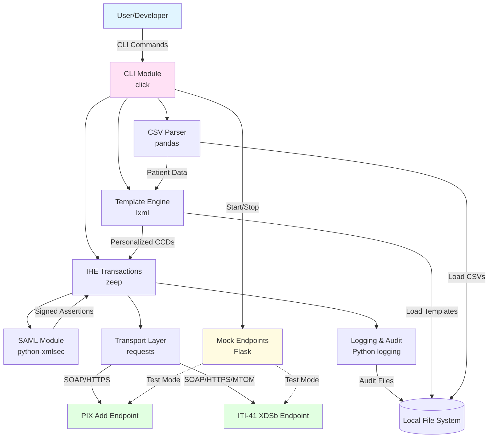
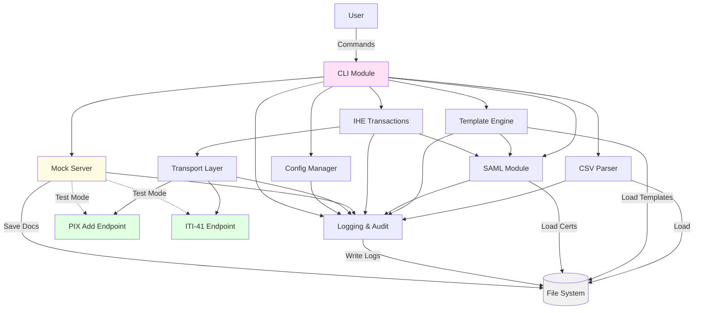
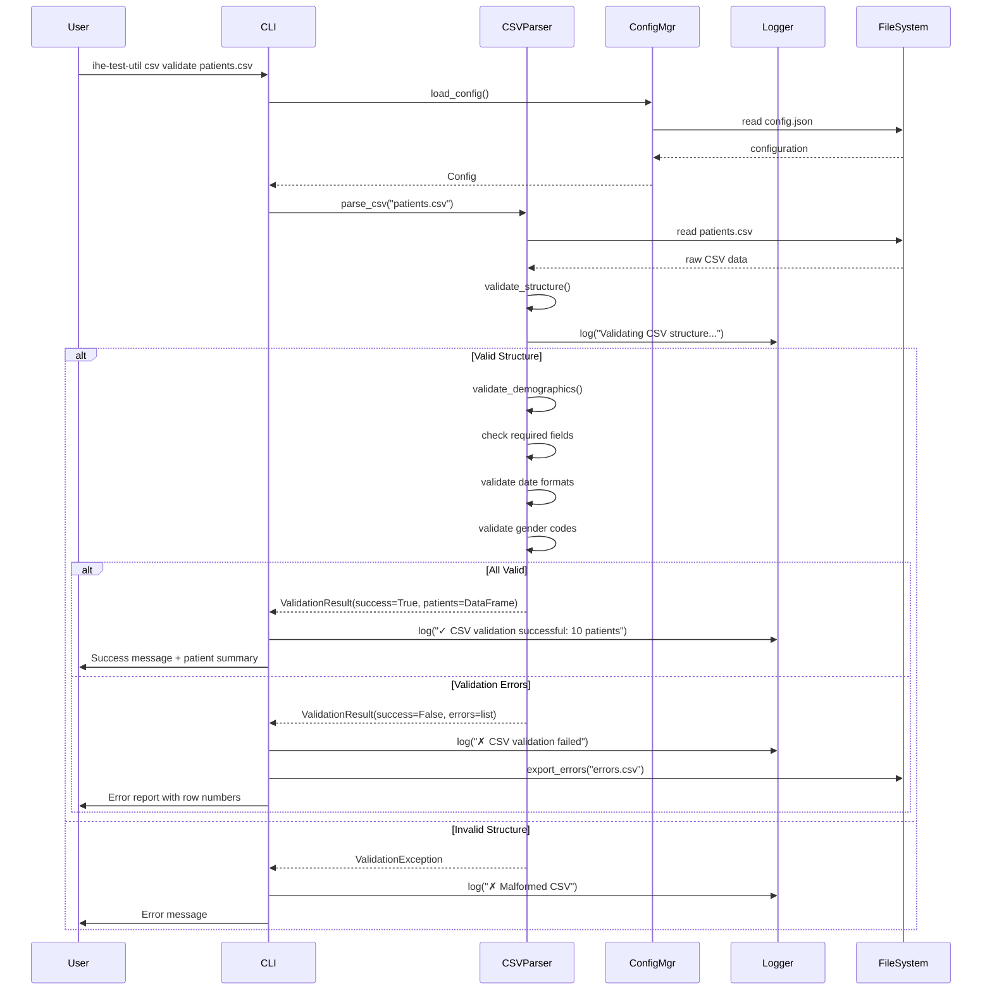
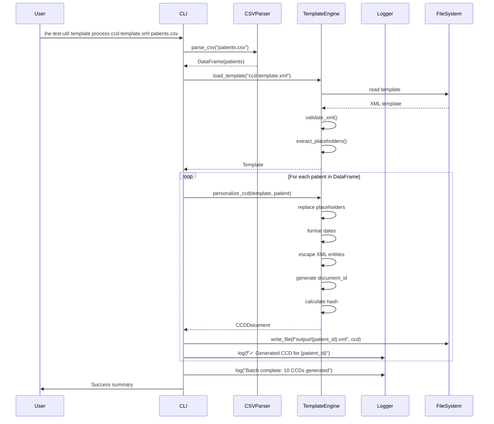
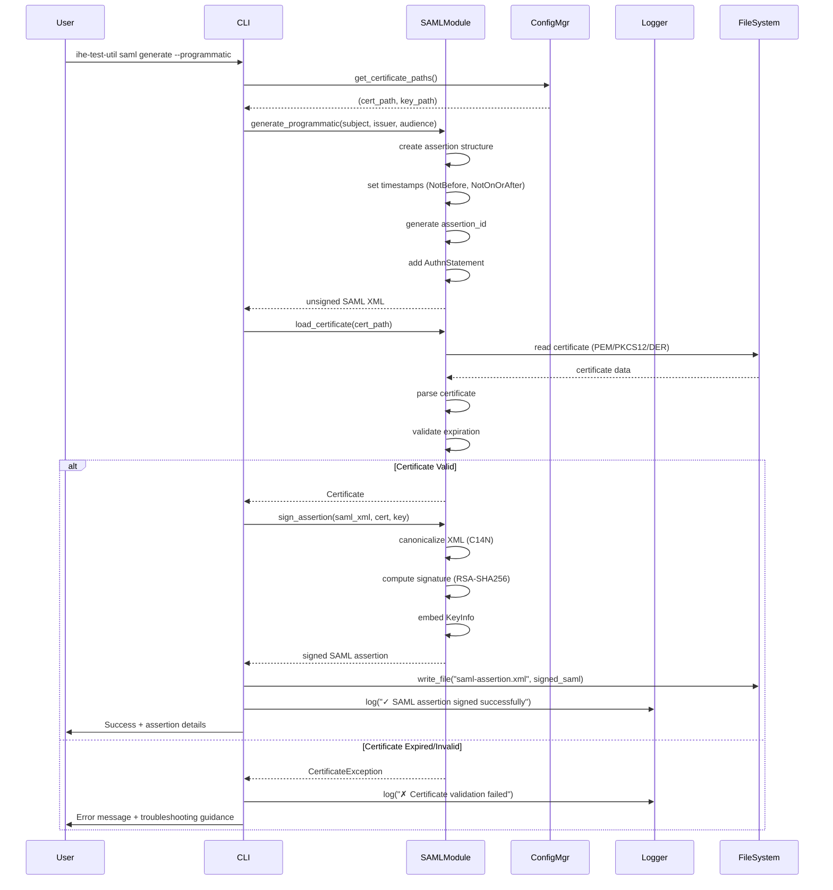
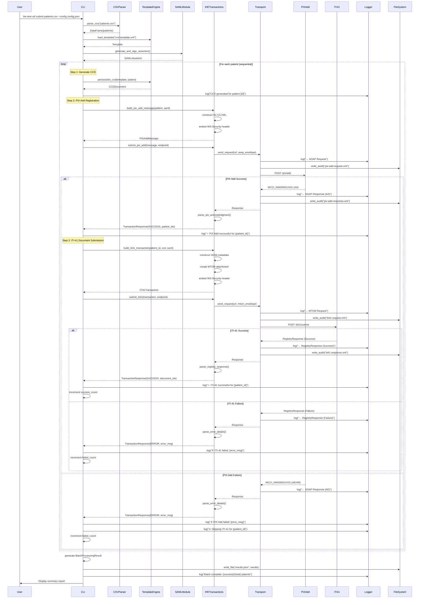
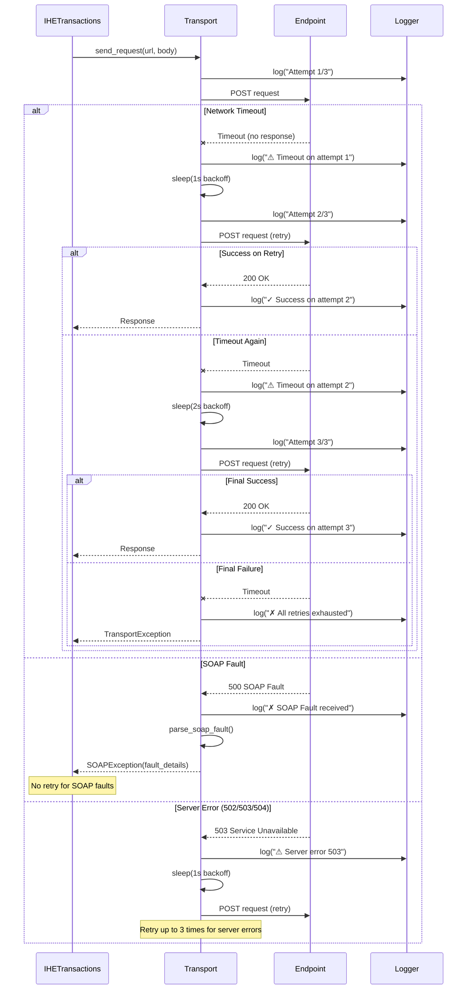
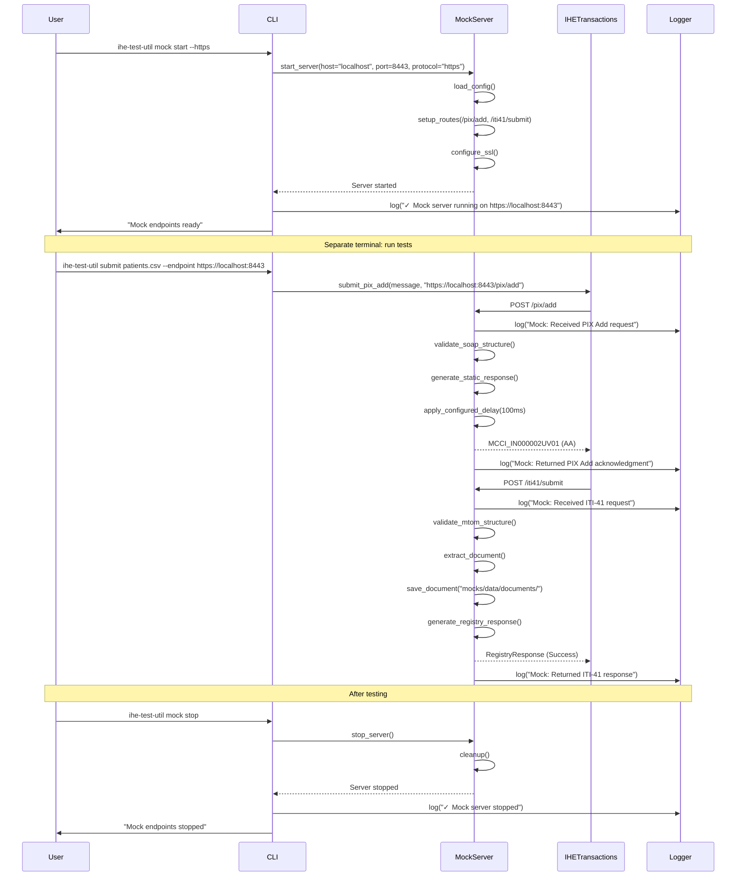

# IHE Test Utility Architecture Document

## Introduction

This document outlines the overall project architecture for **Python Utility for IHE Test Patient Creation and CCD Submission**, including backend systems, CLI interface, mock endpoints, and IHE transaction processing. Its primary goal is to serve as the guiding architectural blueprint for AI-driven development, ensuring consistency and adherence to chosen patterns and technologies.

**Note on Scope:** This is a command-line utility with no user interface. All user interaction occurs through terminal commands. The architecture focuses on backend processing, SOAP transaction handling, security (SAML/XML signing), and mock endpoint infrastructure.

### Starter Template or Existing Project

**Decision:** N/A - Greenfield project. Manual setup required for project structure, dependencies, and tooling.

Based on review of the PRD and Brief, this is a **greenfield project** with no starter template mentioned. The project structure will be created from scratch following Python best practices for CLI utilities.

### Change Log

| Date | Version | Description | Author |
|------|---------|-------------|--------|
| 2025-11-02 | 0.1 | Initial architecture document | Architect |

## High Level Architecture

### Technical Summary

The IHE Test Utility employs a **modular monolith architecture** packaged as a single Python CLI application. The system reads CSV demographic data, generates personalized HL7 CCD documents from XML templates, creates and signs SAML assertions for authentication, and submits IHE transactions (PIX Add patient registration and ITI-41 document submission) via SOAP/HTTPS to healthcare endpoints. The architecture prioritizes simplicity, testability, and developer experience through clear module boundaries, comprehensive logging, and built-in mock IHE endpoints for isolated testing. This design directly supports the PRD goals of 10x faster test data creation, 95%+ transaction success rates, and batch processing of 100+ patients in under 5 minutes.

### High Level Overview

**Architectural Style:** Modular Monolith with CLI-Driven Workflow
- Single Python package with clear separation of concerns across modules
- Sequential processing model (no multi-threading in MVP for simplified error handling)
- Template-based flexibility for CCDs and SAML assertions

**Repository Structure:** Monorepo (single repository)
- All components (CLI, transaction processors, mock endpoints, templates, tests) in one repository
- Simplified dependency management via single `pyproject.toml`
- Easier version synchronization and deployment

**Service Architecture:** Modular Python Package
- **CLI Module** - Command-line interface using `click` framework
- **CSV Parser** - Demographics import and validation using `pandas`
- **Template Engine** - XML template personalization using `lxml`
- **IHE Transactions** - PIX Add and ITI-41 SOAP clients using `zeep`
- **SAML Module** - SAML generation and XML signing using `python-xmlsec`
- **Transport Layer** - HTTP/HTTPS client with TLS configuration
- **Mock Endpoints** - Flask-based test servers simulating PIX Add and ITI-41

**Primary Data Flow:**
1. User executes CLI command with CSV file path
2. CSV Parser validates and loads patient demographics
3. Template Engine personalizes CCD documents for each patient
4. SAML Module generates and signs authentication assertions
5. IHE Transactions module submits PIX Add (patient registration)
6. Upon success, IHE Transactions submits ITI-41 (document with MTOM)
7. Responses parsed, logged, and results returned to CLI

**Key Architectural Decisions:**
- **Local Execution:** No Docker/containerization requirement simplifies adoption
- **Mock-First Testing:** Built-in Flask endpoints enable development without external dependencies
- **Sequential Processing:** Prioritizes reliability and clear audit trails over speed
- **Template Agnostic:** Accepts user-provided XML templates rather than hard-coded structures

### High Level Project Diagram



### Architectural and Design Patterns

**1. Command Pattern (CLI Structure)**
- Encapsulate operations as commands with clear parameters
- Enable composability and scriptability for automation
- **Rationale:** CLI tools benefit from discrete, well-defined commands. Supports CI/CD integration and user scripting workflows.

**2. Repository Pattern (Data Access Abstraction)**
- Abstract file I/O for CSVs, templates, and certificates
- Enable easy mocking for unit tests
- **Rationale:** Simplifies testing and allows future migration to alternative storage (e.g., database for patient records in Phase 2).

**3. Template Method Pattern (Transaction Processing)**
- Define skeleton of PIX Add and ITI-41 workflows
- Allow customization of SAML generation approach (template vs programmatic)
- **Rationale:** Both IHE transactions follow similar patterns (build message → sign → submit → parse response). Pattern eliminates duplication.

**4. Strategy Pattern (SAML Generation)**
- Support two SAML approaches: template-based with substitution or programmatic generation
- Select strategy based on configuration
- **Rationale:** Organizations have varying SAML requirements. Strategy pattern provides flexibility without code duplication.

**5. Facade Pattern (IHE Transaction Module)**
- Provide simplified interface to complex SOAP/SAML/XML signing operations
- Hide zeep, lxml, and python-xmlsec complexity from CLI
- **Rationale:** Healthcare integration protocols are complex. Facade reduces cognitive load for maintenance and testing.

**6. Chain of Responsibility Pattern (Error Handling)**
- Categorize errors: transient (retry), permanent (skip patient), critical (halt batch)
- Route errors through handlers for logging, retry logic, and user notification
- **Rationale:** Robust error handling critical for batch processing. Pattern enables graceful degradation and detailed audit trails.

**7. Mock Object Pattern (Test Endpoints)**
- Flask-based mock servers replicate PIX Add and ITI-41 behavior
- Enable isolated testing without external IHE endpoints
- **Rationale:** External test beds (NIST) have availability issues. Mocks enable fast, reliable CI/CD testing.

## Tech Stack

### Cloud Infrastructure

**Not Applicable** - This is a local CLI utility with no cloud infrastructure requirements. All processing occurs on the user's local machine in a Python virtual environment.

### Technology Stack Table

| Category | Technology | Version | Purpose | Rationale |
|----------|-----------|---------|---------|--------------|
| **Language** | Python | 3.10+ | Primary development language | Modern features (type hints, pattern matching), excellent library ecosystem, wide healthcare integration adoption |
| **Runtime** | CPython | 3.10+ | Python interpreter | Standard Python implementation, best compatibility with dependencies |
| **Package Manager** | pip | Latest | Dependency management | Standard Python package manager, widely supported |
| **Build Tool** | setuptools | Latest | Package building | Standard Python build system, supports pyproject.toml |
| **Project Config** | pyproject.toml | PEP 518 | Project metadata and dependencies | Modern Python standard, consolidates configuration |
| **CLI Framework** | click | 8.1+ | Command-line interface | Superior to argparse for complex CLIs, excellent documentation, decorator-based API |
| **CSV Processing** | pandas | 2.1+ | CSV import and data validation | Robust data manipulation, excellent error handling, widely used |
| **XML Processing** | lxml | 5.1+ | XML parsing and template processing | High performance, standards-compliant, supports XPath and XSLT |
| **SOAP Client** | zeep | 4.2+ | SOAP/WSDL client with WS-Security | Most mature Python SOAP library, supports WS-Addressing and WS-Security |
| **SAML Library** | pysaml2 | 7.4+ | SAML 2.0 assertion generation | Mature enterprise-grade library, comprehensive SAML support |
| **XML Signing** | python-xmlsec | 1.3+ | XML signature and canonicalization | Python bindings to xmlsec C library, industry standard |
| **HTTP Client** | requests | 2.31+ | HTTP/HTTPS transport | De facto standard, excellent TLS support, simple API |
| **Mock Server** | Flask | 3.0+ | Mock IHE endpoints for testing | Lightweight, well-documented, easy to configure |
| **WSGI Server** | Werkzeug | 3.0+ | Development server for Flask mocks | Built-in with Flask, sufficient for local testing |
| **Testing Framework** | pytest | 7.4+ | Unit, integration, and E2E tests | Superior to unittest, excellent plugin ecosystem |
| **Test Coverage** | pytest-cov | 4.1+ | Code coverage reporting | Integrates with pytest, generates HTML/XML reports |
| **Test Mocking** | pytest-mock | 3.12+ | Simplified mocking in tests | pytest-native wrapper around unittest.mock |
| **Test Fixtures** | pytest-fixtures | Built-in | Reusable test data | Part of pytest core, supports complex fixture chains |
| **Logging** | logging | Built-in | Structured logging and audit trails | Python standard library, no dependencies |
| **Configuration** | python-dotenv | 1.0+ | Environment variable management | Load .env files for configuration |
| **Date/Time** | python-dateutil | 2.8+ | Date parsing and formatting | Robust date handling for HL7 timestamps |
| **Validation** | pydantic | 2.5+ | Data validation and settings | Type-safe configuration and data validation |
| **Cryptography** | cryptography | 41.0+ | Certificate handling and TLS | Dependency of pysaml2, modern crypto primitives |
| **Code Linting** | ruff | 0.1+ | Fast Python linter | Modern replacement for flake8, significantly faster |
| **Type Checking** | mypy | 1.7+ | Static type checking | Catches type errors before runtime |
| **Code Formatting** | black | 23.12+ | Opinionated code formatter | Eliminates style debates, widely adopted |
| **CI/CD Platform** | GitHub Actions | N/A | Continuous integration | Free for open source, excellent Python support |
| **Documentation** | Markdown | N/A | Project documentation | Simple, readable, version-controllable |
| **Version Control** | Git | 2.40+ | Source control | Industry standard |

### Additional Dependencies (Transitive)

These are required by primary dependencies but listed for transparency:

- **certifi** - Certificate bundle for TLS verification
- **charset-normalizer** - Character encoding detection
- **idna** - Internationalized domain name support
- **urllib3** - HTTP connection pooling (used by requests)
- **defusedxml** - XML bomb protection (used by pysaml2)

### Development Tools

| Tool | Purpose |
|------|---------| 
| **VS Code / PyCharm** | Recommended IDE |
| **virtualenv / venv** | Virtual environment isolation |
| **pip-tools** | Dependency version locking (optional) |
| **pre-commit** | Git pre-commit hooks (optional) |

## Data Models

The IHE Test Utility processes several key data entities throughout its workflow. These models represent the conceptual structure of data as it flows from CSV input through personalization, security, and SOAP submission.

### Patient Demographics

**Purpose:** Represents patient demographic information imported from CSV files and used to personalize CCD documents and PIX Add messages.

**Key Attributes:**
- `patient_id`: str - Unique patient identifier (auto-generated if not provided)
- `patient_id_oid`: str - OID for patient identifier domain (required in CSV)
- `first_name`: str - Patient first name (required)
- `last_name`: str - Patient last name (required)
- `dob`: date - Date of birth in YYYY-MM-DD format (required)
- `gender`: str - Administrative gender code: M, F, O, U (required)
- `mrn`: str (optional) - Medical record number
- `ssn`: str (optional) - Social security number
- `address`: str (optional) - Street address
- `city`: str (optional) - City
- `state`: str (optional) - State/province
- `zip`: str (optional) - Postal code
- `phone`: str (optional) - Contact phone number
- `email`: str (optional) - Contact email

**Relationships:**
- One Patient has one personalized CCD Document
- One Patient generates one PIX Add Message
- One Patient generates one ITI-41 Transaction

**Python Type Representation:**
```python
from dataclasses import dataclass
from datetime import date
from typing import Optional

@dataclass
class PatientDemographics:
    patient_id: str
    patient_id_oid: str
    first_name: str
    last_name: str
    dob: date
    gender: str  # M, F, O, U
    mrn: Optional[str] = None
    ssn: Optional[str] = None
    address: Optional[str] = None
    city: Optional[str] = None
    state: Optional[str] = None
    zip: Optional[str] = None
    phone: Optional[str] = None
    email: Optional[str] = None
```

### CCD Document

**Purpose:** Represents a personalized HL7 Continuity of Care Document (CCDA) generated from template with patient-specific data.

**Key Attributes:**
- `document_id`: str - Unique document identifier (UUID)
- `patient_id`: str - Reference to patient demographics
- `template_path`: str - Path to XML template used
- `xml_content`: str - Personalized XML document content
- `creation_timestamp`: datetime - Document generation timestamp
- `mime_type`: str - Always "text/xml" for CCDs
- `size_bytes`: int - Document size for metadata
- `sha256_hash`: str - Document hash for integrity verification

**Relationships:**
- Belongs to one Patient
- Referenced in one ITI-41 Transaction

**Python Type Representation:**
```python
from dataclasses import dataclass
from datetime import datetime

@dataclass
class CCDDocument:
    document_id: str
    patient_id: str
    template_path: str
    xml_content: str
    creation_timestamp: datetime
    mime_type: str = "text/xml"
    size_bytes: int = 0
    sha256_hash: str = ""
```

### SAML Assertion

**Purpose:** Represents a SAML 2.0 authentication assertion used to secure SOAP transactions.

**Key Attributes:**
- `assertion_id`: str - Unique assertion ID
- `issuer`: str - SAML assertion issuer identifier
- `subject`: str - Subject (user) identifier
- `audience`: str - Intended audience (endpoint URL)
- `issue_instant`: datetime - Issuance timestamp
- `not_before`: datetime - Validity start time
- `not_on_or_after`: datetime - Validity end time
- `xml_content`: str - Complete SAML assertion XML
- `signature`: str - XML signature element
- `certificate_subject`: str - Signing certificate subject DN
- `generation_method`: str - "template" or "programmatic"

**Relationships:**
- Embedded in PIX Add Message
- Embedded in ITI-41 Transaction

**Python Type Representation:**
```python
from dataclasses import dataclass
from datetime import datetime
from enum import Enum

class SAMLGenerationMethod(Enum):
    TEMPLATE = "template"
    PROGRAMMATIC = "programmatic"

@dataclass
class SAMLAssertion:
    assertion_id: str
    issuer: str
    subject: str
    audience: str
    issue_instant: datetime
    not_before: datetime
    not_on_or_after: datetime
    xml_content: str
    signature: str
    certificate_subject: str
    generation_method: SAMLGenerationMethod
```

### PIX Add Message

**Purpose:** Represents an HL7v3 PRPA_IN201301UV02 patient registration message for PIX Add transactions.

**Key Attributes:**
- `message_id`: str - Unique message identifier (UUID)
- `patient`: PatientDemographics - Patient demographics
- `message_creation_time`: datetime - Message creation timestamp
- `sender_oid`: str - Sending application OID
- `receiver_oid`: str - Receiving application OID
- `hl7v3_xml`: str - Complete HL7v3 message XML
- `saml_assertion`: SAMLAssertion - Embedded SAML for authentication

**Relationships:**
- Contains one PatientDemographics
- Contains one SAMLAssertion
- Results in one PIX Add Acknowledgment

**Python Type Representation:**
```python
from dataclasses import dataclass
from datetime import datetime

@dataclass
class PIXAddMessage:
    message_id: str
    patient: PatientDemographics
    message_creation_time: datetime
    sender_oid: str
    receiver_oid: str
    hl7v3_xml: str
    saml_assertion: SAMLAssertion
```

### ITI-41 Transaction

**Purpose:** Represents a Provide and Register Document Set-b transaction for submitting CCD documents to XDSb repository.

**Key Attributes:**
- `transaction_id`: str - Unique transaction identifier
- `submission_set_id`: str - XDSb submission set unique ID
- `patient_id`: str - Patient identifier from PIX Add
- `patient_id_oid`: str - Patient ID OID
- `ccd_document`: CCDDocument - CCD document to submit
- `submission_timestamp`: datetime - Submission timestamp
- `source_id`: str - Submission source OID
- `saml_assertion`: SAMLAssertion - SAML for authentication
- `mtom_content_id`: str - MTOM attachment content ID
- `soap_xml`: str - Complete SOAP envelope with metadata

**Relationships:**
- Contains one CCDDocument
- Contains one SAMLAssertion
- References one Patient (via patient_id)
- Results in one Registry Response

**Python Type Representation:**
```python
from dataclasses import dataclass
from datetime import datetime

@dataclass
class ITI41Transaction:
    transaction_id: str
    submission_set_id: str
    patient_id: str
    patient_id_oid: str
    ccd_document: CCDDocument
    submission_timestamp: datetime
    source_id: str
    saml_assertion: SAMLAssertion
    mtom_content_id: str
    soap_xml: str
```

### Transaction Response

**Purpose:** Represents acknowledgment or error response from IHE endpoints (PIX Add or ITI-41).

**Key Attributes:**
- `response_id`: str - Response message ID
- `request_id`: str - Original request message ID for correlation
- `transaction_type`: str - "PIX_ADD" or "ITI_41"
- `status`: str - "SUCCESS", "ERROR", "PARTIAL_SUCCESS"
- `status_code`: str - HL7/XDSb status code (e.g., "AA", "AE", "AR")
- `response_timestamp`: datetime - Response receipt timestamp
- `response_xml`: str - Complete SOAP response
- `extracted_identifiers`: dict - Patient IDs from acknowledgment
- `error_messages`: list[str] - Error details if status is ERROR
- `processing_time_ms`: int - Round-trip latency

**Relationships:**
- Corresponds to one PIX Add Message or ITI-41 Transaction

**Python Type Representation:**
```python
from dataclasses import dataclass, field
from datetime import datetime
from enum import Enum

class TransactionType(Enum):
    PIX_ADD = "PIX_ADD"
    ITI_41 = "ITI_41"

class TransactionStatus(Enum):
    SUCCESS = "SUCCESS"
    ERROR = "ERROR"
    PARTIAL_SUCCESS = "PARTIAL_SUCCESS"

@dataclass
class TransactionResponse:
    response_id: str
    request_id: str
    transaction_type: TransactionType
    status: TransactionStatus
    status_code: str
    response_timestamp: datetime
    response_xml: str
    extracted_identifiers: dict = field(default_factory=dict)
    error_messages: list[str] = field(default_factory=list)
    processing_time_ms: int = 0
```

### Batch Processing Result

**Purpose:** Aggregates results from processing multiple patients in a batch operation.

**Key Attributes:**
- `batch_id`: str - Unique batch identifier
- `csv_file_path`: str - Source CSV file
- `start_timestamp`: datetime - Batch processing start time
- `end_timestamp`: datetime - Batch processing end time
- `total_patients`: int - Total patients in CSV
- `successful_patients`: int - Patients successfully processed
- `failed_patients`: int - Patients that failed processing
- `pix_add_success_count`: int - Successful PIX Add transactions
- `iti41_success_count`: int - Successful ITI-41 transactions
- `patient_results`: list[PatientResult] - Per-patient results
- `error_summary`: dict - Categorized error statistics

**Relationships:**
- Contains multiple PatientResult entries

**Python Type Representation:**
```python
from dataclasses import dataclass, field
from datetime import datetime

@dataclass
class PatientResult:
    patient_id: str
    pix_add_status: TransactionStatus
    pix_add_message: str
    iti41_status: TransactionStatus
    iti41_message: str
    processing_time_ms: int

@dataclass
class BatchProcessingResult:
    batch_id: str
    csv_file_path: str
    start_timestamp: datetime
    end_timestamp: datetime
    total_patients: int
    successful_patients: int
    failed_patients: int
    pix_add_success_count: int
    iti41_success_count: int
    patient_results: list[PatientResult] = field(default_factory=list)
    error_summary: dict = field(default_factory=dict)
```

## Components

The IHE Test Utility is organized as a modular monolith with clear separation of concerns. Each component has well-defined responsibilities and interfaces, enabling isolated testing and future extensibility.

### CLI Module

**Responsibility:** 
Primary user interface providing command-line commands for all utility operations. Orchestrates workflows by coordinating other components based on user input.

**Key Interfaces:**
- `ihe-test-util --version` - Display utility version
- `ihe-test-util csv validate <file>` - Validate CSV structure and content
- `ihe-test-util csv process <file>` - Process CSV and display patient summary
- `ihe-test-util template validate <file>` - Validate XML template structure
- `ihe-test-util template process <template> <csv>` - Generate personalized CCDs
- `ihe-test-util saml generate` - Generate SAML assertion (template or programmatic)
- `ihe-test-util saml verify <file>` - Verify SAML signature and validity
- `ihe-test-util pix-add register <csv>` - Execute PIX Add patient registration
- `ihe-test-util submit <csv>` - Complete workflow (PIX Add + ITI-41)
- `ihe-test-util mock start` - Start mock IHE endpoints
- `ihe-test-util mock stop` - Stop mock IHE endpoints

**Dependencies:** 
- CSV Parser (for patient data)
- Template Engine (for CCD generation)
- SAML Module (for assertion handling)
- IHE Transactions (for PIX Add and ITI-41)
- Mock Server Manager (for test endpoint control)
- Config Manager (for configuration loading)
- Logger (for user-facing output and audit)

**Technology Stack:** 
- `click` 8.1+ for CLI framework
- `rich` (optional) for enhanced terminal output
- Python `argparse` patterns for complex option groups

**Implementation Notes:**
- Command groups organized hierarchically: `csv`, `template`, `saml`, `pix-add`, `mock`
- Common options: `--config <path>`, `--verbose`, `--output <dir>`
- Exit codes: 0 (success), 1 (validation error), 2 (transaction error), 3 (critical error)
- Progress display via logging (no interactive progress bars in MVP)

### CSV Parser Module

**Responsibility:** 
Import patient demographic data from CSV files, validate required fields, enforce data types, and generate unique patient IDs when missing.

**Key Interfaces:**
- `parse_csv(file_path: str) -> pd.DataFrame` - Parse and validate CSV
- `validate_demographics(df: pd.DataFrame) -> ValidationResult` - Validate patient data
- `generate_patient_id(seed: Optional[str]) -> str` - Generate unique patient ID
- `export_validation_errors(errors: list, output_path: str)` - Export error report

**Dependencies:**
- Config Manager (for OID defaults and validation rules)
- Logger (for validation warnings and errors)

**Technology Stack:**
- `pandas` 2.1+ for CSV parsing and data manipulation
- `pydantic` 2.5+ for data validation
- Python `csv` module as fallback for malformed files

**Implementation Notes:**
- Required columns: `first_name`, `last_name`, `dob`, `gender`, `patient_id_oid`
- Optional columns: `patient_id`, `mrn`, `ssn`, `address`, `city`, `state`, `zip`, `phone`, `email`
- Date validation: Parse `dob` into `datetime.date`, reject future dates
- Gender validation: Accept only M, F, O, U (case-insensitive)
- ID generation format: `TEST-{UUID4}` for reproducibility
- UTF-8 encoding handling with fallback detection

### Template Engine Module

**Responsibility:**
Load XML templates (CCD and SAML), perform string replacement with patient-specific values, and validate personalized output.

**Key Interfaces:**
- `load_template(template_path: str) -> Template` - Load and parse XML template
- `personalize_ccd(template: Template, patient: PatientDemographics) -> CCDDocument` - Generate personalized CCD
- `personalize_saml(template: Template, params: dict) -> str` - Generate personalized SAML
- `extract_placeholders(template: Template) -> list[str]` - Find all placeholders in template
- `validate_xml(xml_content: str) -> bool` - Validate well-formed XML

**Dependencies:**
- Logger (for template processing status)
- Config Manager (for placeholder syntax configuration)

**Technology Stack:**
- `lxml` 5.1+ for XML parsing and manipulation
- Python string `Template` for placeholder replacement (simple approach)
- `defusedxml` for XML bomb protection

**Implementation Notes:**
- Placeholder syntax: `{{field_name}}` (configurable)
- Special character escaping: &, <, >, ", ' automatically handled
- Date formatting: `{{dob}}` → `YYYYMMDD` for HL7, `YYYY-MM-DD` for display
- OID insertion: `{{patient_id_oid}}` → value from CSV
- Whitespace preservation from original template
- Template caching for batch operations

### SAML Module

**Responsibility:**
Generate SAML 2.0 assertions using template-based or programmatic approaches, sign assertions with X.509 certificates using XML signatures, and verify assertion validity.

**Key Interfaces:**
- `generate_from_template(template_path: str, params: dict) -> SAMLAssertion` - Template-based generation
- `generate_programmatic(subject: str, issuer: str, audience: str) -> SAMLAssertion` - Programmatic generation
- `sign_assertion(assertion_xml: str, cert_path: str, key_path: str) -> str` - Sign SAML with certificate
- `verify_assertion(signed_xml: str) -> bool` - Verify signature and timestamps
- `load_certificate(cert_path: str, format: str) -> Certificate` - Load X.509 certificate (PEM, PKCS12, DER)

**Dependencies:**
- Template Engine (for template-based SAML)
- Config Manager (for certificate paths and SAML defaults)
- Logger (for signing operations and errors)

**Technology Stack:**
- `pysaml2` 7.4+ for SAML 2.0 generation
- `python-xmlsec` 1.3+ for XML signature/verification
- `cryptography` 41.0+ for certificate handling

**Implementation Notes:**
- Assertion validity: 5 minutes by default (configurable)
- Signing algorithm: RSA-SHA256 (configurable)
- Certificate formats: PEM (priority), PKCS12, DER
- XML canonicalization: C14N to prevent tampering
- Timestamp validation on verification
- KeyInfo includes certificate reference in signature

### IHE Transactions Module

**Responsibility:**
Construct HL7v3 PIX Add messages and ITI-41 XDSb transactions, manage SOAP client connections, embed SAML in WS-Security headers, handle MTOM attachments, and parse responses.

**Key Interfaces:**
- `build_pix_add_message(patient: PatientDemographics, saml: SAMLAssertion) -> PIXAddMessage` - Build HL7v3 registration message
- `submit_pix_add(message: PIXAddMessage, endpoint: str) -> TransactionResponse` - Submit PIX Add via SOAP
- `build_iti41_transaction(patient_id: str, ccd: CCDDocument, saml: SAMLAssertion) -> ITI41Transaction` - Build document submission
- `submit_iti41(transaction: ITI41Transaction, endpoint: str) -> TransactionResponse` - Submit ITI-41 with MTOM
- `parse_pix_acknowledgment(response_xml: str) -> TransactionResponse` - Parse MCCI_IN000002UV01
- `parse_registry_response(response_xml: str) -> TransactionResponse` - Parse XDSb RegistryResponse

**Dependencies:**
- SAML Module (for authentication assertions)
- Transport Layer (for HTTP/HTTPS communication)
- Logger (for request/response logging)
- Config Manager (for endpoint URLs and OIDs)

**Technology Stack:**
- `zeep` 4.2+ for SOAP client with WS-Security
- `lxml` 5.1+ for HL7v3 message construction
- `requests` 2.31+ for underlying HTTP transport

**Implementation Notes:**
- HL7v3 message types: PRPA_IN201301UV02 (PIX Add), MCCI_IN000002UV01 (Acknowledgment)
- WS-Addressing headers: Action, MessageID, To, ReplyTo
- WS-Security: SAML embedded in `<wsse:Security>` header
- MTOM: Base64-encoded CCD with Content-ID reference
- XDSb metadata: classCode, typeCode, formatCode, author, submission set
- Retry logic: 3 attempts with exponential backoff (configurable)
- Timeout: 30s for PIX Add, 60s for ITI-41 (configurable)

### Transport Layer Module

**Responsibility:**
Handle HTTP/HTTPS communication with configurable TLS settings, manage connection pooling and timeouts, implement retry logic with exponential backoff, and log all requests/responses.

**Key Interfaces:**
- `send_request(url: str, method: str, body: str, headers: dict) -> Response` - Send HTTP/HTTPS request
- `configure_tls(verify: bool, cert_path: Optional[str], key_path: Optional[str])` - Configure TLS settings
- `set_timeout(connect_timeout: int, read_timeout: int)` - Configure timeouts
- `enable_retry(max_retries: int, backoff_factor: float)` - Configure retry logic

**Dependencies:**
- Logger (for request/response audit trail)
- Config Manager (for transport configuration)

**Technology Stack:**
- `requests` 2.31+ with `Session` for connection pooling
- `urllib3` for retry logic
- `certifi` for CA certificate bundle

**Implementation Notes:**
- TLS 1.2+ enforcement for HTTPS
- Certificate verification enabled by default (disable for testing with warning)
- Connection pooling: 10 connections per host
- Retry on: connection errors, timeouts, 502/503/504 status codes
- No retry on: 4xx client errors (except 429), successful responses
- Exponential backoff: 1s, 2s, 4s delays
- User-Agent header: `IHE-Test-Utility/{version} Python/{python_version}`

### Mock Server Module

**Responsibility:**
Provide Flask-based mock PIX Add and ITI-41 endpoints for isolated testing, support HTTP/HTTPS with configurable responses, log all interactions, and enable scenario-based testing.

**Key Interfaces:**
- `start_server(host: str, port: int, protocol: str)` - Start mock server
- `stop_server()` - Stop mock server gracefully
- `configure_responses(config: dict)` - Load response templates and behaviors
- `get_server_status() -> dict` - Return running status and configuration

**Dependencies:**
- Config Manager (for mock server configuration)
- Logger (for request/response logging)

**Technology Stack:**
- `Flask` 3.0+ for HTTP server
- `Werkzeug` 3.0+ for WSGI server
- Python `ssl` module for HTTPS

**Implementation Notes:**

**PIX Add Mock Endpoint (`/pix/add`):**
- Accepts HL7v3 PRPA_IN201301UV02 messages
- Validates SOAP envelope structure (basic)
- Returns MCCI_IN000002UV01 acknowledgment with pre-configured patient ID
- Status code: AA (success), configurable for error scenarios
- Response delay: 0-5000ms (configurable)

**ITI-41 Mock Endpoint (`/iti41/submit`):**
- Accepts XDSb Provide and Register Document Set-b with MTOM
- Validates SOAP structure and MTOM attachment presence
- Returns RegistryResponse with success status
- Saves submitted documents to `mocks/data/documents/` (optional)
- Logs metadata to `mocks/logs/iti41-submissions/`

**Configuration Options:**
- Success/failure rates (e.g., 10% failure for testing)
- Custom SOAP fault messages
- Response delays (simulate network latency)
- Strict vs lenient validation modes

### Configuration Manager Module

**Responsibility:**
Load configuration from JSON files and environment variables, manage precedence (CLI > env > file > defaults), validate configuration structure, and provide type-safe access to settings.

**Key Interfaces:**
- `load_config(config_path: Optional[str]) -> Config` - Load configuration with precedence
- `get_endpoint(endpoint_name: str) -> str` - Get PIX Add or ITI-41 endpoint URL
- `get_certificate_paths() -> tuple[str, str]` - Get certificate and key paths
- `get_transport_config() -> TransportConfig` - Get HTTP/HTTPS settings
- `validate_config(config: dict) -> ValidationResult` - Validate configuration structure

**Dependencies:**
- Logger (for configuration warnings)

**Technology Stack:**
- Python `json` module for parsing
- `python-dotenv` 1.0+ for .env file support
- `pydantic` 2.5+ for configuration validation

**Implementation Notes:**
- Default config location: `./config/config.json`
- Environment variable prefix: `IHE_TEST_`
- Precedence order: CLI flags > env vars > config file > defaults
- Sensitive values (passwords, keys) via env vars only
- Configuration schema validation on load
- Example config provided in `examples/config.example.json`

### Logging & Audit Module

**Responsibility:**
Provide structured logging across all components, manage log levels and output destinations, create audit trail for compliance, and optionally redact PII from logs.

**Key Interfaces:**
- `get_logger(module_name: str) -> Logger` - Get configured logger for module
- `log_transaction(transaction_type: str, request: str, response: str)` - Log complete transaction
- `log_audit_event(event_type: str, details: dict)` - Log audit event
- `configure_logging(level: str, output_path: str, redact_pii: bool)` - Configure logging

**Dependencies:**
- Config Manager (for logging configuration)

**Technology Stack:**
- Python `logging` module with handlers and formatters
- `logging.handlers.RotatingFileHandler` for log rotation

**Implementation Notes:**
- Log levels: DEBUG, INFO, WARNING, ERROR, CRITICAL
- Console output: INFO and above (configurable)
- File output: DEBUG and above
- Log format: `%(asctime)s - %(name)s - %(levelname)s - %(message)s`
- Log rotation: 10MB per file, keep 5 rotated files
- Audit trail location: `./logs/audit/`
- Transaction logs: `./logs/transactions/`
- PII redaction: Optional, regex-based for SSN, names (when `--redact-pii` flag used)

### Component Interaction Diagram



## External APIs

This utility integrates with **IHE (Integrating the Healthcare Enterprise) endpoints** for healthcare interoperability testing. These are SOAP-based web services implementing standard IHE profiles.

### PIX Add (Patient Identity Feed) API

**Purpose:** Patient registration and identity management. Registers patient demographics with a Patient Identifier Cross-reference Manager.

**Documentation:** 
- IHE ITI TF-2b: Patient Identifier Cross-referencing HL7 V3 (ITI-44)
- HL7 Version 3 PRPA_IN201301UV02 Message Specification
- https://profiles.ihe.net/ITI/TF/Volume2/ITI-44.html

**Base URL(s):** Configurable per environment
- Development: `http://localhost:8080/pix/add` (mock server)
- Internal Testing: Organization-specific test endpoints
- Production: Varies by organization

**Authentication:** WS-Security with SAML 2.0 assertion (signed with X.509 certificate)

**Rate Limits:** 
- Test environments: Typically no limits
- Production: Organization-specific, generally 100-1000 requests/minute

**Key Endpoints Used:**
- `POST /pix/add` - Submit HL7v3 PRPA_IN201301UV02 patient registration message

**Integration Notes:**
- **Message Format:** HL7 Version 3 XML (not HL7 v2 pipe-delimited)
- **Required Elements:** Patient ID with OID, demographics (name, DOB, gender)
- **Response Format:** HL7v3 MCCI_IN000002UV01 acknowledgment
- **Status Codes:** AA (accepted), AE (error), AR (rejected)
- **Timeout Recommendation:** 30 seconds
- **Idempotency:** Not guaranteed - duplicate submissions may create duplicate records
- **Error Handling:** Parse acknowledgment status, extract error details from response
- **Testing:** Mock endpoint provides static acknowledgments with pre-configured IDs

### ITI-41 (Provide and Register Document Set-b) API

**Purpose:** Submit clinical documents (CCDs) to an XDSb Document Repository with metadata registration.

**Documentation:**
- IHE ITI TF-2b: Provide and Register Document Set-b (ITI-41)
- XDS.b Document Sharing Infrastructure
- https://profiles.ihe.net/ITI/TF/Volume2/ITI-41.html

**Base URL(s):** Configurable per environment
- Development: `http://localhost:8080/iti41/submit` (mock server)
- Internal Testing: Organization-specific test endpoints
- Production: Varies by organization

**Authentication:** WS-Security with SAML 2.0 assertion (signed with X.509 certificate)

**Rate Limits:**
- Test environments: Typically no limits
- Production: Organization-specific, generally 10-100 documents/minute (lower due to document size)

**Key Endpoints Used:**
- `POST /DocumentRepository_Service` - Submit ProvideAndRegisterDocumentSetRequest with MTOM attachment

**Integration Notes:**
- **Message Format:** SOAP with MTOM (MIME multipart) for document attachment
- **Required Metadata:** Patient ID, document unique ID, submission set ID, classCode, typeCode, formatCode
- **Document Format:** HL7 CCD (CCDA R2.1) as XML attachment
- **Response Format:** XDSb RegistryResponse with status and unique IDs
- **Status Values:** Success, Failure, PartialSuccess
- **Timeout Recommendation:** 60 seconds (documents can be large)
- **MTOM Handling:** CCD attached with Content-ID reference in metadata
- **Document Hash:** SHA-256 hash included in metadata for integrity verification
- **Error Handling:** Parse RegistryErrorList for detailed error information
- **Testing:** Mock endpoint validates MTOM structure, saves documents locally

### Test Environments

**Local Mock Endpoints (Included in Utility):**
- **URL:** `http://localhost:8080` or `https://localhost:8443`
- **Purpose:** Isolated testing without external dependencies
- **Access:** No authentication required (or configurable)
- **Advantages:** Fast, reliable, no network dependencies, perfect for CI/CD
- **Limitations:** Static responses, minimal validation, does not test against real IHE implementations

**Internal Organization Test Endpoints:**
- **URL:** Varies by organization (configured via config.json)
- **Purpose:** Integration testing against organization-specific IHE infrastructure
- **Access:** Organization-specific authentication and certificates required
- **Usage:** Primary environment for integration testing

### External API Integration Strategy

1. **Development Phase:** Use local mock endpoints exclusively for rapid iteration
2. **Integration Testing:** Validate against internal organization test endpoints
3. **Pre-Production:** Test against organization-specific staging environments
4. **Continuous Integration:** Use mock endpoints in CI/CD pipelines for speed and reliability

**Security Considerations:**
- All production endpoints MUST use HTTPS with valid certificates
- HTTP allowed only for local mock endpoints (with warnings)
- SAML assertions MUST be signed with valid X.509 certificates
- Certificate expiration monitoring recommended
- Audit logs MUST capture all external API interactions

## Core Workflows

This section illustrates key system workflows using sequence diagrams to show component interactions and data flow.

### Workflow 1: CSV Validation and Patient Import



### Workflow 2: CCD Document Generation from Template



### Workflow 3: SAML Assertion Generation and Signing



### Workflow 4: Complete PIX Add + ITI-41 Submission (Primary Workflow)



### Workflow 5: Error Handling with Retry Logic



### Workflow 6: Mock Server Testing



---

## Source Tree

Based on the PRD's monorepo structure and modular Python package architecture, here's the project folder structure:

```
ihe-test-utility/
├── .github/
│   └── workflows/
│       ├── ci.yml                      # CI pipeline: linting, testing, coverage
│       └── publish.yml                 # PyPI publication workflow
├── src/
│   └── ihe_test_util/
│       ├── __init__.py                 # Package initialization, version
│       ├── __main__.py                 # Entry point for `python -m ihe_test_util`
│       ├── cli/
│       │   ├── __init__.py
│       │   ├── main.py                 # Main CLI entry point (click)
│       │   ├── csv_commands.py         # csv validate, csv process commands
│       │   ├── template_commands.py    # template validate, template process
│       │   ├── saml_commands.py        # saml generate, saml verify
│       │   ├── pix_commands.py         # pix-add register command
│       │   ├── submit_commands.py      # submit command (main workflow)
│       │   └── mock_commands.py        # mock start, mock stop, mock status
│       ├── csv_parser/
│       │   ├── __init__.py
│       │   ├── parser.py               # CSV parsing logic (pandas)
│       │   ├── validator.py            # Demographics validation (pydantic)
│       │   └── id_generator.py         # Patient ID generation
│       ├── template_engine/
│       │   ├── __init__.py
│       │   ├── loader.py               # Template loading and caching
│       │   ├── personalizer.py         # String replacement engine
│       │   └── validators.py           # XML validation
│       ├── ihe_transactions/
│       │   ├── __init__.py
│       │   ├── pix_add.py              # PIX Add message builder and submitter
│       │   ├── iti41.py                # ITI-41 transaction builder and submitter
│       │   ├── soap_client.py          # Zeep SOAP client wrapper
│       │   ├── parsers.py              # Response parsers (acknowledgment, registry)
│       │   └── mtom.py                 # MTOM attachment handling
│       ├── saml/
│       │   ├── __init__.py
│       │   ├── generator.py            # SAML generation (template & programmatic)
│       │   ├── signer.py               # XML signing with python-xmlsec
│       │   ├── verifier.py             # Signature verification
│       │   └── certificate_manager.py  # Certificate loading (PEM/PKCS12/DER)
│       ├── transport/
│       │   ├── __init__.py
│       │   ├── http_client.py          # Requests-based HTTP/HTTPS client
│       │   ├── retry_logic.py          # Exponential backoff retry handler
│       │   └── tls_config.py           # TLS configuration
│       ├── mock_server/
│       │   ├── __init__.py
│       │   ├── app.py                  # Flask application
│       │   ├── pix_add_endpoint.py     # /pix/add mock endpoint
│       │   ├── iti41_endpoint.py       # /iti41/submit mock endpoint
│       │   └── config.py               # Mock server configuration
│       ├── config/
│       │   ├── __init__.py
│       │   ├── manager.py              # Configuration loading and validation
│       │   ├── schema.py               # Pydantic configuration models
│       │   └── defaults.py             # Default configuration values
│       ├── logging_audit/
│       │   ├── __init__.py
│       │   ├── logger.py               # Logging configuration
│       │   ├── audit.py                # Audit trail functions
│       │   └── formatters.py           # Custom log formatters
│       ├── models/
│       │   ├── __init__.py
│       │   ├── patient.py              # PatientDemographics dataclass
│       │   ├── ccd.py                  # CCDDocument dataclass
│       │   ├── saml.py                 # SAMLAssertion dataclass
│       │   ├── transactions.py         # PIXAddMessage, ITI41Transaction
│       │   ├── responses.py            # TransactionResponse dataclass
│       │   └── batch.py                # BatchProcessingResult dataclass
│       └── utils/
│           ├── __init__.py
│           ├── xml_utils.py            # XML helper functions
│           ├── oid_utils.py            # OID validation and formatting
│           ├── date_utils.py           # HL7 date formatting
│           └── exceptions.py           # Custom exception classes
├── mocks/
│   ├── __init__.py
│   ├── data/
│   │   ├── documents/                  # Saved submitted CCDs (optional)
│   │   └── responses/                  # Response templates
│   ├── logs/
│   │   ├── pix-add.log                 # PIX Add mock request logs
│   │   └── iti41-submissions/          # ITI-41 submission logs
│   └── config.json                     # Mock server configuration
├── templates/
│   ├── ccd-template.xml                # Example CCD template
│   ├── ccd-minimal.xml                 # Minimal CCD example
│   ├── saml-template.xml               # Example SAML template
│   └── README.md                       # Template documentation
├── tests/
│   ├── __init__.py
│   ├── conftest.py                     # Pytest fixtures and configuration
│   ├── unit/
│   │   ├── __init__.py
│   │   ├── test_csv_parser.py
│   │   ├── test_template_engine.py
│   │   ├── test_saml.py
│   │   ├── test_ihe_transactions.py
│   │   ├── test_transport.py
│   │   ├── test_config.py
│   │   └── test_models.py
│   ├── integration/
│   │   ├── __init__.py
│   │   ├── test_pix_add_flow.py        # PIX Add against mock endpoint
│   │   ├── test_iti41_flow.py          # ITI-41 against mock endpoint
│   │   ├── test_mock_server.py         # Mock server behavior
│   │   └── test_certificate_loading.py # Certificate handling
│   ├── e2e/
│   │   ├── __init__.py
│   │   ├── test_complete_workflow.py   # CSV → PIX Add → ITI-41
│   │   └── test_batch_processing.py    # 100 patient batch test
│   └── fixtures/
│       ├── sample_patients.csv         # Test CSV data
│       ├── test_ccd_template.xml       # Test CCD template
│       ├── test_cert.pem               # Test certificate
│       └── test_key.pem                # Test private key
├── examples/
│   ├── config.example.json             # Example configuration file
│   ├── patients_sample.csv             # Sample patient data (10 patients)
│   ├── patients_minimal.csv            # Minimal CSV example
│   └── tutorials/
│       ├── 01-csv-validation.md        # Tutorial: CSV validation
│       ├── 02-ccd-generation.md        # Tutorial: CCD generation
│       ├── 03-pix-add.md               # Tutorial: PIX Add registration
│       ├── 04-complete-workflow.md     # Tutorial: Complete workflow
│       └── 05-mock-endpoints.md        # Tutorial: Using mock endpoints
├── docs/
│   ├── prd.md                          # Product Requirements Document
│   ├── brief.md                        # Project Brief
│   ├── architecture.md                 # This architecture document
│   ├── csv-format.md                   # CSV format specification
│   ├── ccd-templates.md                # CCD template guide
│   ├── saml-guide.md                   # SAML configuration guide
│   ├── mock-servers.md                 # Mock server documentation
│   ├── troubleshooting.md              # Common issues and solutions
│   └── api-reference.md                # API/CLI reference
├── scripts/
│   ├── generate_test_data.py           # Generate test CSV files
│   ├── generate_cert.sh                # Self-signed certificate generation
│   └── setup_dev.sh                    # Development environment setup
├── config/
│   ├── config.json                     # Default configuration
│   └── logging.conf                    # Logging configuration
├── logs/                                # Created at runtime
│   ├── audit/                          # Audit trail logs
│   ├── transactions/                   # Transaction request/response logs
│   └── ihe-test-util.log               # Main application log
├── .env.example                        # Environment variables template
├── .gitignore                          # Git ignore rules
├── .pre-commit-config.yaml             # Pre-commit hooks configuration
├── pyproject.toml                      # Project metadata and dependencies
├── setup.py                            # Setuptools configuration (if needed)
├── requirements.txt                    # Pinned dependencies for deployment
├── requirements-dev.txt                # Development dependencies
├── pytest.ini                          # Pytest configuration
├── mypy.ini                            # Type checking configuration
├── ruff.toml                           # Linting configuration
├── README.md                           # Project overview and quick start
├── LICENSE                             # License file (MIT/Apache 2.0)
└── CHANGELOG.md                        # Version history
```

**Key Structure Decisions:**

1. **src/ Layout:** Modern Python packaging with `src/ihe_test_util/` prevents import confusion
2. **Module Organization:** Each component gets its own directory with clear responsibility
3. **Separation of Tests:** `tests/` at root level, mirroring `src/` structure
4. **Mock Server Isolation:** `mocks/` separate from main application code
5. **Template & Example Separation:** `templates/` for runtime use, `examples/` for documentation
6. **Configuration Files:** Separate `config/` directory for all configuration
7. **Logs Generated at Runtime:** `logs/` created when needed, not committed to Git

**Installation & Entry Points:**

```toml
# pyproject.toml excerpt
[project.scripts]
ihe-test-util = "ihe_test_util.cli.main:cli"

[tool.setuptools.packages.find]
where = ["src"]
```

**Import Conventions:**

```python
# Within the package
from ihe_test_util.models.patient import PatientDemographics
from ihe_test_util.csv_parser.parser import parse_csv
from ihe_test_util.ihe_transactions.pix_add import submit_pix_add

# External usage after installation
from ihe_test_util import __version__
```

## Infrastructure and Deployment

**Note:** This is a local CLI utility with no cloud infrastructure. Deployment focuses on Python package distribution.

### Infrastructure as Code

**Not Applicable** - No cloud infrastructure to manage. Local execution only.

### Deployment Strategy

**Distribution Method:** Python Package (PyPI)
- **Primary Distribution:** PyPI (Python Package Index) via `pip install ihe-test-utility`
- **Alternative:** GitHub Releases with wheel (.whl) and source distribution (.tar.gz)
- **Optional:** Docker image for users preferring containerization (not required)

**Build Process:**
```bash
# Build distributions
python -m build

# Outputs:
# dist/ihe_test_utility-0.1.0-py3-none-any.whl
# dist/ihe_test_utility-0.1.0.tar.gz
```

**Installation:**
```bash
# From PyPI
pip install ihe-test-utility

# From GitHub release
pip install https://github.com/org/ihe-test-utility/releases/download/v0.1.0/ihe_test_utility-0.1.0-py3-none-any.whl

# Development mode
git clone https://github.com/org/ihe-test-utility.git
cd ihe-test-utility
pip install -e ".[dev]"
```

### Environments

| Environment | Purpose | Installation Method |
|-------------|---------|---------------------|
| **Development** | Local development and testing | `pip install -e ".[dev]"` from source |
| **CI/CD** | Automated testing in GitHub Actions | `pip install -e ".[dev]"` from checkout |
| **User Installation** | End-user deployment | `pip install ihe-test-utility` from PyPI |
| **Docker (Optional)** | Containerized execution | `docker build -t ihe-test-utility .` |

### CI/CD Pipeline

**Platform:** GitHub Actions

**Pipeline Stages:**

```yaml
# .github/workflows/ci.yml
name: CI Pipeline

on: [push, pull_request]

jobs:
  lint:
    runs-on: ubuntu-latest
    steps:
      - uses: actions/checkout@v4
      - uses: actions/setup-python@v5
        with:
          python-version: '3.10'
      - run: pip install ruff mypy
      - run: ruff check src/ tests/
      - run: mypy src/
  
  test:
    strategy:
      matrix:
        os: [ubuntu-latest, windows-latest, macos-latest]
        python-version: ['3.10', '3.11', '3.12']
    runs-on: ${{ matrix.os }}
    steps:
      - uses: actions/checkout@v4
      - uses: actions/setup-python@v5
        with:
          python-version: ${{ matrix.python-version }}
      - run: pip install -e ".[dev]"
      - run: pytest tests/ --cov=ihe_test_util --cov-report=xml
      - uses: codecov/codecov-action@v3
        if: matrix.os == 'ubuntu-latest' && matrix.python-version == '3.10'
  
  build:
    needs: [lint, test]
    runs-on: ubuntu-latest
    steps:
      - uses: actions/checkout@v4
      - uses: actions/setup-python@v5
      - run: pip install build
      - run: python -m build
      - uses: actions/upload-artifact@v3
        with:
          name: distributions
          path: dist/
```

### Rollback Strategy

**Rollback Method:** Version pinning
- Users pin to previous working version: `pip install ihe-test-utility==0.0.9`
- PyPI retains all previous versions indefinitely

**Trigger Conditions:**
- Critical bugs discovered in production use
- Breaking changes to IHE transaction handling
- Security vulnerabilities

**Recovery Time Objective:** Immediate (users can downgrade anytime)

## Error Handling Strategy

### General Approach

**Error Model:** Exception-based with categorization
- **TransportError:** Network, timeout, connection issues (retryable)
- **ValidationError:** CSV, XML, configuration validation (non-retryable)
- **TransactionError:** IHE transaction failures (may be retryable)
- **SecurityError:** Certificate, SAML, signing issues (non-retryable)
- **SystemError:** Unexpected failures (non-retryable)

**Exception Hierarchy:**
```python
class IHETestUtilError(Exception):
    """Base exception for all utility errors"""
    pass

class ValidationError(IHETestUtilError):
    """Data validation failures"""
    pass

class TransportError(IHETestUtilError):
    """Network and transport failures"""
    pass

class TransactionError(IHETestUtilError):
    """IHE transaction failures"""
    pass

class SecurityError(IHETestUtilError):
    """Certificate and signing failures"""
    pass
```

**Error Propagation:** 
- Exceptions bubble up to CLI layer
- CLI layer catches, logs, displays user-friendly messages
- Exit codes indicate error category

### Logging Standards

**Library:** Python `logging` module
**Format:** `%(asctime)s - %(name)s - %(levelname)s - %(message)s`
**Levels:**
- **DEBUG:** Detailed diagnostic information (request/response details)
- **INFO:** Confirmation of expected operation (patient processed)
- **WARNING:** Something unexpected but recoverable (retry initiated)
- **ERROR:** Operation failed (patient skipped)
- **CRITICAL:** System-level failure (halting batch)

**Required Context:**
- **Correlation ID:** Unique ID per batch operation
- **Service Context:** Module name (csv_parser, ihe_transactions, etc.)
- **User Context:** Redacted patient identifiers (when applicable)

### Error Handling Patterns

#### External API Errors

**Retry Policy:**
- Max retries: 3
- Backoff strategy: Exponential (1s, 2s, 4s)
- Retry on: Connection errors, timeouts, 502/503/504
- No retry on: 4xx client errors, SOAP faults

**Circuit Breaker:** Not implemented in MVP (sequential processing)

**Timeout Configuration:**
- PIX Add: 30 seconds
- ITI-41: 60 seconds
- Configurable via configuration file

**Error Translation:**
```python
# SOAP fault → TransactionError with parsed details
# Network timeout → TransportError with retry indication
# HL7 AE/AR status → TransactionError with HL7 error details
```

#### Business Logic Errors

**Custom Exceptions:**
- `PatientValidationError`: Invalid demographics data
- `TemplateProcessingError`: Template personalization failures
- `SAMLGenerationError`: SAML assertion creation failures

**User-Facing Errors:** Clear, actionable messages with troubleshooting steps

**Error Codes:** Structured format: `{category}-{code}` (e.g., `VAL-001`, `TXN-042`)

#### Data Consistency

**Transaction Strategy:** No database transactions (file-based operations)

**Compensation Logic:**
- Failed PIX Add → Skip patient, log, continue batch
- Failed ITI-41 → Log error, continue to next patient
- Critical failures → Halt batch, preserve processed results

**Idempotency:** 
- Patient ID generation is deterministic with seed
- IHE transactions are NOT idempotent by specification
- Retry logic must account for potential duplicates

## Coding Standards

**⚠️ These standards are MANDATORY for AI agents and developers.**

### Core Standards

**Languages & Runtimes:**
- Python 3.10+ (minimum version)
- Type hints required for all function signatures
- Docstrings required for all public functions (Google style)

**Style & Linting:**
- **Formatter:** `black` with default settings (88-character line length)
- **Linter:** `ruff` with project-specific rules
- **Type Checker:** `mypy` in strict mode

**Test Organization:**
- Unit tests in `tests/unit/`, mirror `src/` structure
- Integration tests in `tests/integration/`
- E2E tests in `tests/e2e/`
- Test files named `test_*.py`
- Test functions named `test_*`

### Naming Conventions

| Element | Convention | Example |
|---------|-----------|---------|
| **Modules** | snake_case | `csv_parser.py` |
| **Classes** | PascalCase | `PatientDemographics` |
| **Functions** | snake_case | `parse_csv()` |
| **Variables** | snake_case | `patient_id` |
| **Constants** | UPPER_SNAKE_CASE | `DEFAULT_TIMEOUT` |
| **Private** | Leading underscore | `_internal_function()` |

### Critical Rules

**RULE 1: Never use print() statements**
- **Requirement:** Always use the logging module
- **Rationale:** Enables configurable log levels and audit trails
- **Example:** `logger.info("Processing patient")` not `print("Processing patient")`

**RULE 2: All IHE transactions MUST log complete request/response**
- **Requirement:** Log full SOAP envelopes to audit files
- **Rationale:** Critical for debugging IHE transaction failures
- **Example:** `audit_logger.log_transaction(request_xml, response_xml)`

**RULE 3: Configuration values via Config Manager only**
- **Requirement:** Never access environment variables directly with `os.getenv()`
- **Rationale:** Ensures configuration precedence and validation
- **Example:** `config.get_endpoint("pix_add")` not `os.getenv("PIX_ADD_URL")`

**RULE 4: All file I/O MUST use Path objects**
- **Requirement:** Use `pathlib.Path` not string paths
- **Rationale:** Cross-platform compatibility (Windows/Unix)
- **Example:** `Path("data") / "file.csv"` not `"data/file.csv"`

**RULE 5: Exceptions must include actionable context**
- **Requirement:** Error messages must explain what failed and suggest fixes
- **Rationale:** Improves developer experience and reduces support burden
- **Example:** `raise ValidationError("Invalid gender 'X'. Must be M, F, O, or U.")` not `raise ValidationError("Invalid gender")`

**RULE 6: No bare except clauses**
- **Requirement:** Always catch specific exceptions
- **Rationale:** Prevents hiding bugs and makes error handling explicit
- **Example:** `except TransportError` not `except:`

**RULE 7: Type hints are mandatory**
- **Requirement:** All function signatures must have complete type hints
- **Rationale:** Enables static analysis and catches errors early
- **Example:** `def parse_csv(file_path: Path) -> pd.DataFrame:` not `def parse_csv(file_path):`

## Test Strategy and Standards

### Testing Philosophy

**Approach:** Test-driven development encouraged, test-after acceptable
**Coverage Goals:** 
- Minimum: 75% (CI fails below)
- Target: 80%+
- Critical modules (IHE Transactions, SAML): 90%+

**Test Pyramid:**
- Unit tests: 70% of total tests
- Integration tests: 25% of total tests
- E2E tests: 5% of total tests

### Test Types and Organization

#### Unit Tests

**Framework:** pytest 7.4+
**File Convention:** `tests/unit/test_{module_name}.py`
**Location:** `tests/unit/`
**Mocking Library:** pytest-mock
**Coverage Requirement:** 80%+

**AI Agent Requirements:**
- Generate tests for all public methods
- Cover edge cases and error conditions
- Follow AAA pattern (Arrange, Act, Assert)
- Mock all external dependencies (file I/O, network, etc.)

**Example:**
```python
def test_parse_csv_valid_data(tmp_path):
    # Arrange
    csv_file = tmp_path / "patients.csv"
    csv_file.write_text("first_name,last_name,dob,gender,patient_id_oid\nJohn,Doe,1980-01-01,M,1.2.3.4")
    
    # Act
    result = parse_csv(csv_file)
    
    # Assert
    assert len(result) == 1
    assert result.iloc[0]["first_name"] == "John"
```

#### Integration Tests

**Scope:** Component interactions (e.g., CSV → Template → CCD generation)
**Location:** `tests/integration/`
**Test Infrastructure:**
- **Mock Endpoints:** Flask test client for mock PIX Add and ITI-41
- **File System:** pytest tmp_path fixtures
- **Certificates:** Test certificates in `tests/fixtures/`

**Example:**
```python
def test_pix_add_workflow_against_mock(mock_server, test_patient):
    # Mock server running on localhost:8080
    response = submit_pix_add(test_patient, "http://localhost:8080/pix/add")
    assert response.status == TransactionStatus.SUCCESS
```

#### End-to-End Tests

**Framework:** pytest
**Scope:** Complete CSV → PIX Add → ITI-41 workflows
**Environment:** Mock endpoints (not external test beds in CI)
**Test Data:** `tests/fixtures/sample_patients.csv` (10 diverse patients)

**Example:**
```python
def test_complete_workflow_100_patients(tmp_path, mock_server):
    # Generate 100-patient CSV
    csv_file = generate_test_csv(tmp_path, num_patients=100)
    
    # Execute complete workflow
    start = time.time()
    result = execute_submit_workflow(csv_file)
    duration = time.time() - start
    
    # Assert performance requirements
    assert duration < 300  # Under 5 minutes (NFR1)
    assert result.success_rate >= 0.95  # 95%+ success (PRD goal)
```

### Test Data Management

**Strategy:** Fixtures and factories
**Fixtures:** `tests/conftest.py` for shared fixtures
**Factories:** pytest-factoryboy for model generation (optional)
**Cleanup:** pytest automatically cleans tmp_path fixtures

### Continuous Testing

**CI Integration:** GitHub Actions runs full test suite on push/PR
**Performance Tests:** E2E tests validate 5-minute batch processing requirement
**Security Tests:** Certificate validation, SAML signature verification in integration tests

## Security

### Input Validation

**Validation Library:** pydantic (runtime), mypy (static)
**Validation Location:** At API boundary (CSV parsing, configuration loading)
**Required Rules:**
- All external inputs (CSV, config files, templates) MUST be validated
- Validation at entry points before processing
- Whitelist approach preferred over blacklist
- Reject invalid data with clear error messages

**Example:**
```python
class PatientSchema(BaseModel):
    patient_id: str
    first_name: str = Field(min_length=1, max_length=100)
    dob: date = Field(lt=date.today())
    gender: Literal["M", "F", "O", "U"]
```

### Authentication & Authorization

**Auth Method:** X.509 certificate-based (for SAML signing)
**Session Management:** N/A (CLI tool, no sessions)
**Required Patterns:**
- Certificates loaded only from configured paths
- Certificate expiration validated before use
- Private keys never logged or displayed

### Secrets Management

**Development:** `.env` files (gitignored)
**Production:** Environment variables or OS keychain
**Code Requirements:**
- NEVER hardcode certificates, keys, or endpoints
- Access via Config Manager only
- No secrets in logs or error messages
- No secrets in version control

**Example .env:**
```bash
IHE_TEST_PIX_ADD_ENDPOINT=https://internal-test.org/pix/add
IHE_TEST_CERT_PATH=/path/to/cert.pem
IHE_TEST_KEY_PATH=/path/to/key.pem
```

### API Security

**Rate Limiting:** N/A (client-side tool)
**CORS Policy:** N/A (no web API)
**Security Headers:** N/A (CLI tool)
**HTTPS Enforcement:** Configurable, warnings for HTTP

### Data Protection

**Encryption at Rest:** User responsibility (OS-level encryption)
**Encryption in Transit:** 
- TLS 1.2+ enforced when using HTTPS
- Certificate verification enabled by default
- Disable verification only with explicit flag and warning

**PII Handling:**
- CSV files contain test/synthetic data only (assumption)
- Optional PII redaction in logs via `--redact-pii` flag
- Regex-based redaction for SSN, names in logs

**Logging Restrictions:**
- Never log passwords, private keys, or full certificates
- Log only certificate subject DN, expiration date
- Redact sensitive fields when `--redact-pii` enabled

### Dependency Security

**Scanning Tool:** GitHub Dependabot (automated)
**Update Policy:** 
- Security updates applied within 1 week
- Minor updates quarterly
- Major updates evaluated before adoption

**Approval Process:** 
- New dependencies require PR review
- Justification in PR description
- License compatibility check (MIT/Apache/BSD)

### Security Testing

**SAST Tool:** ruff with security rules, bandit (optional)
**DAST Tool:** N/A (CLI tool, not web service)
**Penetration Testing:** Not applicable for MVP

## Checklist Results Report

**Note:** The architect-checklist should be executed after this architecture document is reviewed and approved by stakeholders. This section will be populated with checklist results at that time.

### Architecture Completeness Assessment

**Status:** Architecture document complete, pending stakeholder review

**Key Strengths:**
- ✅ Comprehensive component design with clear boundaries
- ✅ Well-defined tech stack with specific versions
- ✅ Detailed data models using Python dataclasses
- ✅ Complete workflow documentation with sequence diagrams
- ✅ Security considerations addressed throughout
- ✅ Testing strategy defined (80%+ coverage target)
- ✅ Error handling patterns clearly specified

**Areas Requiring Validation:**
- [ ] Tech stack choices validated against organizational standards
- [ ] IHE endpoint integration tested against internal test infrastructure
- [ ] Certificate management approach approved by security team
- [ ] Mock endpoint fidelity sufficient for development needs

### Readiness for Implementation

**Assessment:** READY for development

**Prerequisites:**
1. Stakeholder review and approval of this architecture document
2. Development environment setup (Python 3.10+, dependencies)
3. Test certificates generated or obtained for SAML signing
4. Internal IHE test endpoint URLs and credentials acquired

**Risk Mitigation:**
- Early prototype of zeep + MTOM integration recommended
- XML signing validation spike before full SAML implementation
- Mock endpoints should be first implementation to enable parallel development

## Next Steps

### Immediate Actions (Post-Architecture Approval)

**1. Technical Validation Spikes (1 week)**

**IMPORTANT:** All technical spikes listed below MUST be formalized as user stories and added to the project plan as part of Epic 0 (Technical Validation Spikes) or integrated into Epic 1 (Foundation & CSV Processing) before development begins.

Conduct focused technical spikes to validate critical architectural decisions:

- **SOAP/MTOM Spike:** Validate zeep library can handle MTOM attachments for ITI-41
  - Create minimal PIX Add and ITI-41 transactions
  - Test against mock endpoints
  - Confirm SOAP envelope structure matches IHE requirements
  - **Action Required:** Create story in Epic 0 or Epic 1

- **XML Signing Spike:** Validate python-xmlsec integration
  - Generate test certificate
  - Sign sample SAML assertion
  - Verify signature validation works correctly
  - Test with different certificate formats (PEM, PKCS12, DER)
  - **Action Required:** Create story in Epic 0 or Epic 1

- **HL7v3 Message Spike:** Validate HL7v3 message construction
  - Build sample PRPA_IN201301UV02 message
  - Parse response MCCI_IN000002UV01
  - Confirm namespace and structure correctness
  - **Action Required:** Create story in Epic 0 or Epic 1

**2. Development Environment Setup**

Prepare development infrastructure:

- Set up project repository following source tree structure
- Configure CI/CD pipeline (GitHub Actions)
- Create development dependencies file
- Generate self-signed certificates for testing
- Set up pre-commit hooks (black, ruff, mypy)

**3. Epic Prioritization for Development**

Based on PRD epic structure and architectural dependencies:

**Phase 1 - Foundation (Weeks 1-2):**
- Epic 1: Foundation & CSV Processing
- Epic 2: Mock IHE Endpoints (enables parallel development)

**Phase 2 - Core Functionality (Weeks 3-5):**
- Epic 3: Template Engine & CCD Personalization
- Epic 4: SAML Generation & XML Signing

**Phase 3 - IHE Transactions (Weeks 6-9):**
- Epic 5: PIX Add Transaction Implementation
- Epic 6: ITI-41 Document Submission & Complete Workflow

**Phase 4 - Quality & Documentation (Weeks 10-12):**
- Epic 7: Integration Testing & Documentation

### Handoff to Development Team

**For Scrum Master (@sm) - Story Creation:**

Use this architecture document in conjunction with the PRD to create detailed user stories:

```
Story Creation Prompt:

"Using the architecture document (docs/architecture.md) and PRD (docs/prd.md), 
create detailed implementation stories for [Epic Name]. 

For each story, include:
- Technical implementation details from the architecture
- Component dependencies from architecture diagrams
- Data models and interfaces to use
- Error handling patterns to follow
- Testing requirements from test strategy section
- Specific coding standards from coding standards section

Ensure stories reference the exact modules from the source tree structure."
```

**For Development Agent - Implementation Guidance:**

When implementing stories, developers should:

1. **Always reference these architecture sections:**
   - Source Tree (for file placement)
   - Components (for module responsibilities and interfaces)
   - Data Models (for data structure definitions)
   - Coding Standards (MANDATORY rules)
   - Error Handling Strategy (for exception patterns)

2. **Follow dependency order:**
   - Config Manager → Logging → CSV Parser → Others
   - Mock Server (independent, can be parallel)
   - Template Engine → SAML Module → IHE Transactions

3. **Use defined interfaces:**
   - Don't invent new interfaces without architectural review
   - Follow type signatures from data models exactly
   - Use exception hierarchy defined in error handling section

4. **Maintain test coverage:**
   - Unit tests for every public function
   - Integration tests for component interactions
   - Follow test organization from test strategy section

### Documentation Tasks

**User Documentation:**
- CSV format specification guide (from data models)
- CCD template creation guide (from template engine specs)
- SAML configuration guide (from SAML module specs)
- Troubleshooting guide (from error handling patterns)

**Developer Documentation:**
- API reference (from component interfaces)
- Contributing guide (coding standards + test strategy)
- Architecture decision records (ADRs) for major decisions

### Ongoing Architectural Governance

**Change Management:**
- Significant architectural changes require update to this document
- New components require architecture review
- External API integrations require security review

**Architecture Review Triggers:**
- Adding new IHE transaction types (Phase 2)
- Changing security implementation (certificates, SAML)
- Modifying error handling strategy
- Introducing new external dependencies

### Success Criteria

**Architecture is successful when:**
- ✅ Development team can implement stories without architectural ambiguity
- ✅ AI agents can generate code following exact patterns specified
- ✅ 95%+ transaction success rate achieved (PRD goal)
- ✅ 100 patient batch processing < 5 minutes (NFR1)
- ✅ 80%+ test coverage maintained (NFR13)
- ✅ All IHE transactions conform to specifications
- ✅ Security requirements met (TLS 1.2+, signed SAML, certificate validation)

---

**Architecture Document Status:** COMPLETE

This architecture document is now ready for stakeholder review and approval. Upon approval, development can proceed with Epic 1 (Foundation & CSV Processing) while the Mock IHE Endpoints (Epic 2) are developed in parallel.
