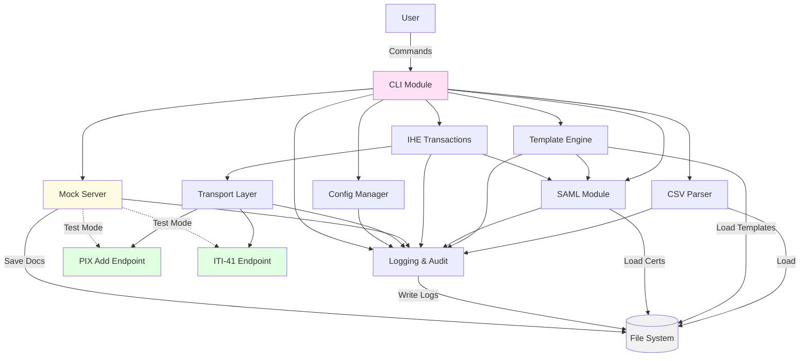

# Components

The IHE Test Utility is organized as a modular monolith with clear separation of concerns. Each component has well-defined responsibilities and interfaces, enabling isolated testing and future extensibility.

### CLI Module

**Responsibility:** 
Primary user interface providing command-line commands for all utility operations. Orchestrates workflows by coordinating other components based on user input.

**Key Interfaces:**
- `ihe-test-util --version` - Display utility version
- `ihe-test-util csv validate <file>` - Validate CSV structure and content
- `ihe-test-util csv process <file>` - Process CSV and display patient summary
- `ihe-test-util template validate <file>` - Validate XML template structure
- `ihe-test-util template process <template> <csv>` - Generate personalized CCDs
- `ihe-test-util saml generate` - Generate SAML assertion (template or programmatic)
- `ihe-test-util saml verify <file>` - Verify SAML signature and validity
- `ihe-test-util pix-add register <csv>` - Execute PIX Add patient registration
- `ihe-test-util submit <csv>` - Complete workflow (PIX Add + ITI-41)
- `ihe-test-util mock start` - Start mock IHE endpoints
- `ihe-test-util mock stop` - Stop mock IHE endpoints

**Dependencies:** 
- CSV Parser (for patient data)
- Template Engine (for CCD generation)
- SAML Module (for assertion handling)
- IHE Transactions (for PIX Add and ITI-41)
- Mock Server Manager (for test endpoint control)
- Config Manager (for configuration loading)
- Logger (for user-facing output and audit)

**Technology Stack:** 
- `click` 8.1+ for CLI framework
- `rich` (optional) for enhanced terminal output
- Python `argparse` patterns for complex option groups

**Implementation Notes:**
- Command groups organized hierarchically: `csv`, `template`, `saml`, `pix-add`, `mock`
- Common options: `--config <path>`, `--verbose`, `--output <dir>`
- Exit codes: 0 (success), 1 (validation error), 2 (transaction error), 3 (critical error)
- Progress display via logging (no interactive progress bars in MVP)

### CSV Parser Module

**Responsibility:** 
Import patient demographic data from CSV files, validate required fields, enforce data types, and generate unique patient IDs when missing.

**Key Interfaces:**
- `parse_csv(file_path: str) -> pd.DataFrame` - Parse and validate CSV
- `validate_demographics(df: pd.DataFrame) -> ValidationResult` - Validate patient data
- `generate_patient_id(seed: Optional[str]) -> str` - Generate unique patient ID
- `export_validation_errors(errors: list, output_path: str)` - Export error report

**Dependencies:**
- Config Manager (for OID defaults and validation rules)
- Logger (for validation warnings and errors)

**Technology Stack:**
- `pandas` 2.1+ for CSV parsing and data manipulation
- `pydantic` 2.5+ for data validation
- Python `csv` module as fallback for malformed files

**Implementation Notes:**
- Required columns: `first_name`, `last_name`, `dob`, `gender`, `patient_id_oid`
- Optional columns: `patient_id`, `mrn`, `ssn`, `address`, `city`, `state`, `zip`, `phone`, `email`
- Date validation: Parse `dob` into `datetime.date`, reject future dates
- Gender validation: Accept only M, F, O, U (case-insensitive)
- ID generation format: `TEST-{UUID4}` for reproducibility
- UTF-8 encoding handling with fallback detection

### Template Engine Module

**Responsibility:**
Load XML templates (CCD and SAML), perform string replacement with patient-specific values, and validate personalized output.

**Key Interfaces:**
- `load_template(template_path: str) -> Template` - Load and parse XML template
- `personalize_ccd(template: Template, patient: PatientDemographics) -> CCDDocument` - Generate personalized CCD
- `personalize_saml(template: Template, params: dict) -> str` - Generate personalized SAML
- `extract_placeholders(template: Template) -> list[str]` - Find all placeholders in template
- `validate_xml(xml_content: str) -> bool` - Validate well-formed XML

**Dependencies:**
- Logger (for template processing status)
- Config Manager (for placeholder syntax configuration)

**Technology Stack:**
- `lxml` 5.1+ for XML parsing and manipulation
- Python string `Template` for placeholder replacement (simple approach)
- `defusedxml` for XML bomb protection

**Implementation Notes:**
- Placeholder syntax: `{{field_name}}` (configurable)
- Special character escaping: &, <, >, ", ' automatically handled
- Date formatting: `{{dob}}` → `YYYYMMDD` for HL7, `YYYY-MM-DD` for display
- OID insertion: `{{patient_id_oid}}` → value from CSV
- Whitespace preservation from original template
- Template caching for batch operations

### SAML Module

**Responsibility:**
Generate SAML 2.0 assertions using lightweight custom generator, sign assertions with X.509 certificates using XML signatures via SignXML, and verify assertion validity.

**Key Interfaces:**
- `generate_saml_assertion(issuer: str, subject: str, validity_minutes: int = 5) -> lxml.Element` - Generate SAML 2.0 assertion
- `sign_assertion(assertion: lxml.Element, cert_pem: bytes, key_pem: bytes) -> lxml.Element` - Sign SAML with SignXML
- `verify_assertion(signed_xml: lxml.Element, cert_pem: bytes) -> bool` - Verify signature and timestamps
- `CertificateManager.load_pem_certificate(cert_path: Path) -> x509.Certificate` - Load PEM certificate
- `CertificateManager.load_pem_private_key(key_path: Path) -> PrivateKey` - Load PEM private key
- `CertificateManager.load_pkcs12(pkcs12_path: Path, password: bytes) -> tuple` - Load PKCS12 bundle
- `CertificateManager.load_der_certificate(cert_path: Path) -> x509.Certificate` - Load DER certificate

**Dependencies:**
- Config Manager (for certificate paths and SAML defaults)
- Logger (for signing operations and errors)

**Technology Stack:**
- `lxml` 5.1+ for SAML 2.0 assertion XML construction
- `signxml` 3.2+ for XML signature/verification (pure Python, W3C XML Signature standard)
- `cryptography` 41.0+ for certificate handling and loading

**Implementation Notes:**
- **Lightweight Generator**: Custom SAML assertion builder using lxml (~100 lines), generates minimal assertions for IHE transactions
- **SAML Structure**: Includes Issuer, Subject (NameID), Conditions (validity window), AuthnStatement
- **SAML Namespace**: `urn:oasis:names:tc:SAML:2.0:assertion`
- **Assertion ID**: UUID4 with `_` prefix (per SAML spec)
- **Assertion validity**: 5 minutes by default (configurable via NotBefore/NotOnOrAfter)
- **Signing algorithm**: RSA-SHA256 via `SignatureMethod.RSA_SHA256`
- **Digest algorithm**: SHA256 via `DigestAlgorithm.SHA256`
- **Canonicalization**: C14N 1.1 (automatic via SignXML)
- **Certificate formats**: PEM (primary), PKCS12 (with password), DER
- **Certificate management**: Dedicated `CertificateManager` class handles all formats
- **Timestamp validation**: Validates NotBefore/NotOnOrAfter on verification
- **KeyInfo embedding**: SignXML automatically includes X.509 certificate in signature
- **Zero compilation**: SignXML is pure Python with pre-built wheels for all platforms
- **Windows compatibility**: No Visual C++ Build Tools required (major improvement over python-xmlsec)
- **Standards compliance**: Implements W3C XML Signature Version 1.1, tested against XMLDSig interoperability suite

**Architecture Decision:**
- See [ADR-002: SignXML for SAML Assertion Signing](adr-002-signxml-for-saml-signing.md) for full rationale on SignXML selection over python-xmlsec
- Validated in Story 1.2 XML Signing Validation Spike with successful demonstration of all requirements

### IHE Transactions Module

**Responsibility:**
Construct HL7v3 PIX Add messages and ITI-41 XDSb transactions, manage SOAP client connections, embed SAML in WS-Security headers, handle MTOM attachments, and parse responses.

**Key Interfaces:**
- `build_pix_add_message(patient: PatientDemographics, saml: SAMLAssertion) -> PIXAddMessage` - Build HL7v3 registration message
- `submit_pix_add(message: PIXAddMessage, endpoint: str) -> TransactionResponse` - Submit PIX Add via SOAP
- `build_iti41_transaction(patient_id: str, ccd: CCDDocument, saml: SAMLAssertion) -> ITI41Transaction` - Build document submission
- `submit_iti41(transaction: ITI41Transaction, endpoint: str) -> TransactionResponse` - Submit ITI-41 with MTOM
- `parse_pix_acknowledgment(response_xml: str) -> TransactionResponse` - Parse MCCI_IN000002UV01
- `parse_registry_response(response_xml: str) -> TransactionResponse` - Parse XDSb RegistryResponse

**Dependencies:**
- SAML Module (for authentication assertions)
- Transport Layer (for HTTP/HTTPS communication)
- Logger (for request/response logging)
- Config Manager (for endpoint URLs and OIDs)

**Technology Stack:**
- `zeep` 4.2+ for SOAP client with WS-Security
- `lxml` 5.1+ for HL7v3 message construction
- `requests` 2.31+ for underlying HTTP transport

**Implementation Notes:**
- HL7v3 message types: PRPA_IN201301UV02 (PIX Add), MCCI_IN000002UV01 (Acknowledgment)
- WS-Addressing headers: Action, MessageID, To, ReplyTo
- WS-Security: SAML embedded in `<wsse:Security>` header
- MTOM: Base64-encoded CCD with Content-ID reference
- XDSb metadata: classCode, typeCode, formatCode, author, submission set
- Retry logic: 3 attempts with exponential backoff (configurable)
- Timeout: 30s for PIX Add, 60s for ITI-41 (configurable)

### Transport Layer Module

**Responsibility:**
Handle HTTP/HTTPS communication with configurable TLS settings, manage connection pooling and timeouts, implement retry logic with exponential backoff, and log all requests/responses.

**Key Interfaces:**
- `send_request(url: str, method: str, body: str, headers: dict) -> Response` - Send HTTP/HTTPS request
- `configure_tls(verify: bool, cert_path: Optional[str], key_path: Optional[str])` - Configure TLS settings
- `set_timeout(connect_timeout: int, read_timeout: int)` - Configure timeouts
- `enable_retry(max_retries: int, backoff_factor: float)` - Configure retry logic

**Dependencies:**
- Logger (for request/response audit trail)
- Config Manager (for transport configuration)

**Technology Stack:**
- `requests` 2.31+ with `Session` for connection pooling
- `urllib3` for retry logic
- `certifi` for CA certificate bundle

**Implementation Notes:**
- TLS 1.2+ enforcement for HTTPS
- Certificate verification enabled by default (disable for testing with warning)
- Connection pooling: 10 connections per host
- Retry on: connection errors, timeouts, 502/503/504 status codes
- No retry on: 4xx client errors (except 429), successful responses
- Exponential backoff: 1s, 2s, 4s delays
- User-Agent header: `IHE-Test-Utility/{version} Python/{python_version}`

### Mock Server Module

**Responsibility:**
Provide Flask-based mock PIX Add and ITI-41 endpoints for isolated testing, support HTTP/HTTPS with configurable responses, log all interactions, and enable scenario-based testing.

**Key Interfaces:**
- `start_server(host: str, port: int, protocol: str)` - Start mock server
- `stop_server()` - Stop mock server gracefully
- `configure_responses(config: dict)` - Load response templates and behaviors
- `get_server_status() -> dict` - Return running status and configuration

**Dependencies:**
- Config Manager (for mock server configuration)
- Logger (for request/response logging)

**Technology Stack:**
- `Flask` 3.0+ for HTTP server
- `Werkzeug` 3.0+ for WSGI server
- Python `ssl` module for HTTPS

**Implementation Notes:**

**PIX Add Mock Endpoint (`/pix/add`):**
- Accepts HL7v3 PRPA_IN201301UV02 messages
- Validates SOAP envelope structure (basic)
- Returns MCCI_IN000002UV01 acknowledgment with pre-configured patient ID
- Status code: AA (success), configurable for error scenarios
- Response delay: 0-5000ms (configurable)

**ITI-41 Mock Endpoint (`/iti41/submit`):**
- Accepts XDSb Provide and Register Document Set-b with MTOM
- Validates SOAP structure and MTOM attachment presence
- Returns RegistryResponse with success status
- Saves submitted documents to `mocks/data/documents/` (optional)
- Logs metadata to `mocks/logs/iti41-submissions/`

**Configuration Options:**
- Success/failure rates (e.g., 10% failure for testing)
- Custom SOAP fault messages
- Response delays (simulate network latency)
- Strict vs lenient validation modes

### Configuration Manager Module

**Responsibility:**
Load configuration from JSON files and environment variables, manage precedence (CLI > env > file > defaults), validate configuration structure, and provide type-safe access to settings.

**Key Interfaces:**
- `load_config(config_path: Optional[str]) -> Config` - Load configuration with precedence
- `get_endpoint(endpoint_name: str) -> str` - Get PIX Add or ITI-41 endpoint URL
- `get_certificate_paths() -> tuple[str, str]` - Get certificate and key paths
- `get_transport_config() -> TransportConfig` - Get HTTP/HTTPS settings
- `validate_config(config: dict) -> ValidationResult` - Validate configuration structure

**Dependencies:**
- Logger (for configuration warnings)

**Technology Stack:**
- Python `json` module for parsing
- `python-dotenv` 1.0+ for .env file support
- `pydantic` 2.5+ for configuration validation

**Implementation Notes:**
- Default config location: `./config/config.json`
- Environment variable prefix: `IHE_TEST_`
- Precedence order: CLI flags > env vars > config file > defaults
- Sensitive values (passwords, keys) via env vars only
- Configuration schema validation on load
- Example config provided in `examples/config.example.json`

### Logging & Audit Module

**Responsibility:**
Provide structured logging across all components, manage log levels and output destinations, create audit trail for compliance, and optionally redact PII from logs.

**Key Interfaces:**
- `get_logger(module_name: str) -> Logger` - Get configured logger for module
- `log_transaction(transaction_type: str, request: str, response: str)` - Log complete transaction
- `log_audit_event(event_type: str, details: dict)` - Log audit event
- `configure_logging(level: str, output_path: str, redact_pii: bool)` - Configure logging

**Dependencies:**
- Config Manager (for logging configuration)

**Technology Stack:**
- Python `logging` module with handlers and formatters
- `logging.handlers.RotatingFileHandler` for log rotation

**Implementation Notes:**
- Log levels: DEBUG, INFO, WARNING, ERROR, CRITICAL
- Console output: INFO and above (configurable)
- File output: DEBUG and above
- Log format: `%(asctime)s - %(name)s - %(levelname)s - %(message)s`
- Log rotation: 10MB per file, keep 5 rotated files
- Audit trail location: `./logs/audit/`
- Transaction logs: `./logs/transactions/`
- PII redaction: Optional, regex-based for SSN, names (when `--redact-pii` flag used)

### Component Interaction Diagram

