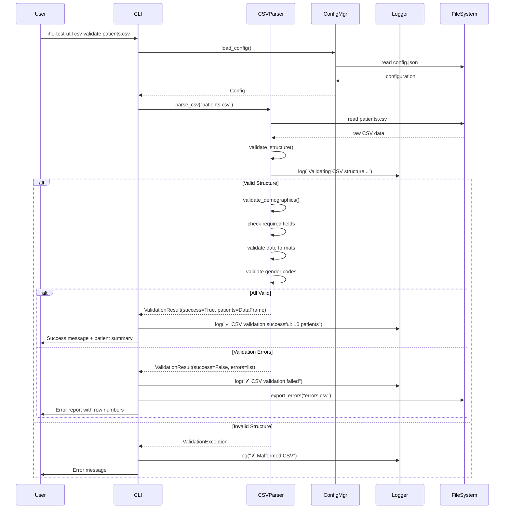
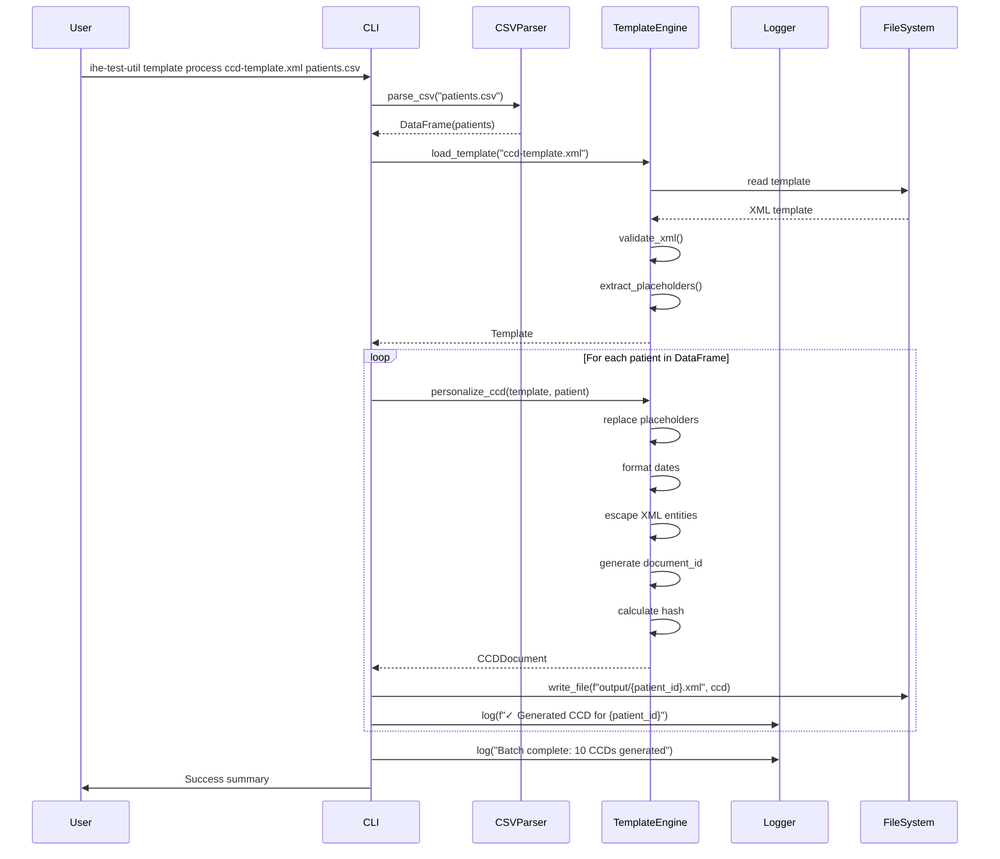
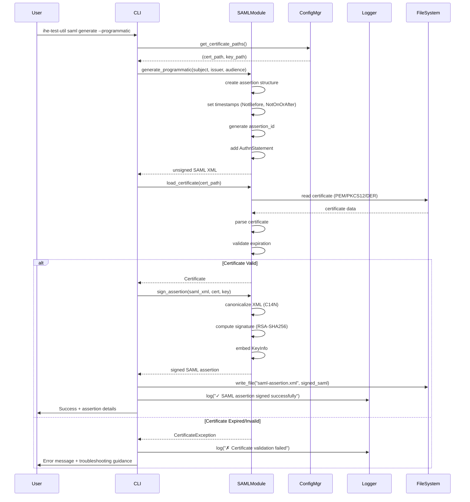
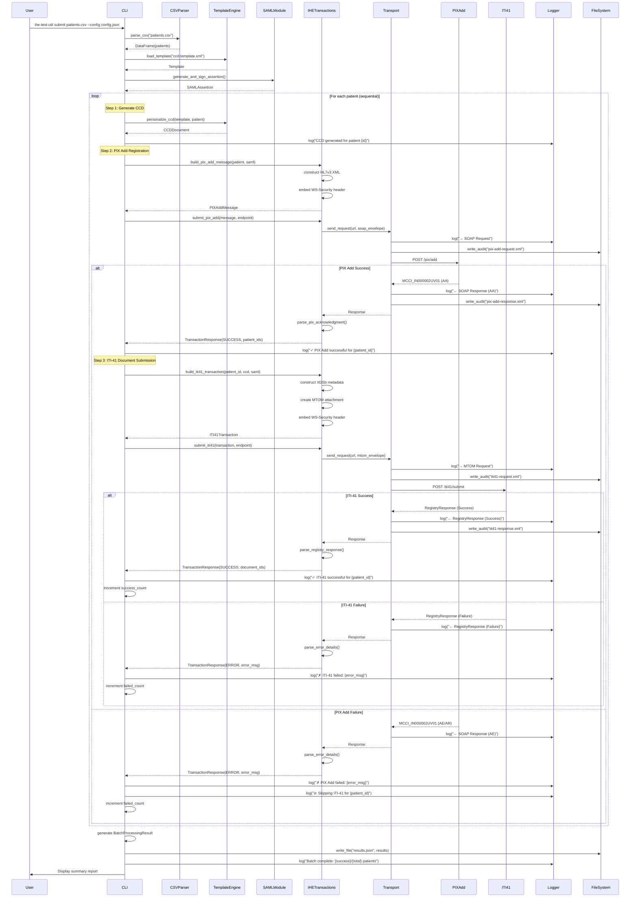
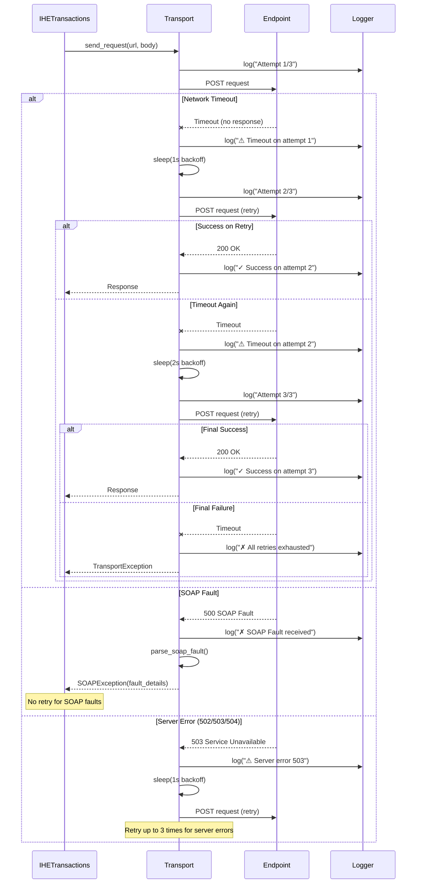
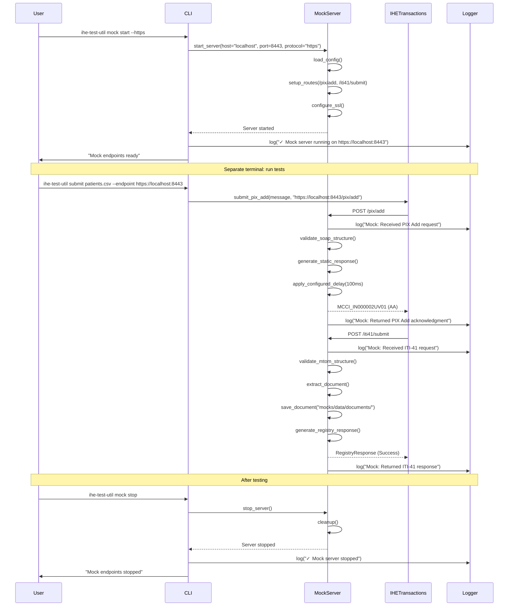

# Core Workflows

This section illustrates key system workflows using sequence diagrams to show component interactions and data flow.

### Workflow 1: CSV Validation and Patient Import

### Workflow 2: CCD Document Generation from Template

### Workflow 3: SAML Assertion Generation and Signing

### Workflow 4: Complete PIX Add + ITI-41 Submission (Primary Workflow)

### Workflow 5: Error Handling with Retry Logic

### Workflow 6: Mock Server Testing

---

