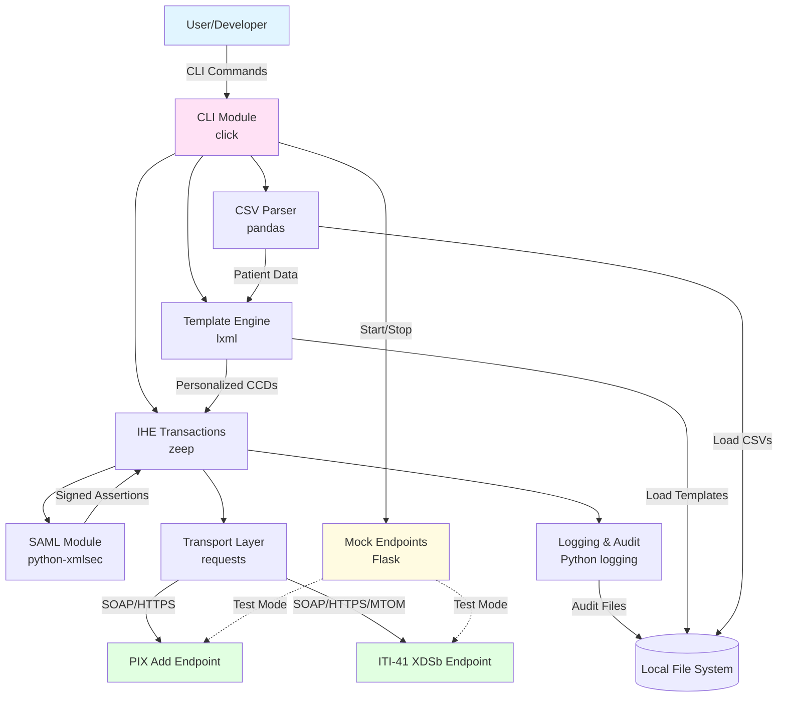

# High Level Architecture

### Technical Summary

The IHE Test Utility employs a **modular monolith architecture** packaged as a single Python CLI application. The system reads CSV demographic data, generates personalized HL7 CCD documents from XML templates, creates and signs SAML assertions for authentication, and submits IHE transactions (PIX Add patient registration and ITI-41 document submission) via SOAP/HTTPS to healthcare endpoints. The architecture prioritizes simplicity, testability, and developer experience through clear module boundaries, comprehensive logging, and built-in mock IHE endpoints for isolated testing. This design directly supports the PRD goals of 10x faster test data creation, 95%+ transaction success rates, and batch processing of 100+ patients in under 5 minutes.

### High Level Overview

**Architectural Style:** Modular Monolith with CLI-Driven Workflow
- Single Python package with clear separation of concerns across modules
- Sequential processing model (no multi-threading in MVP for simplified error handling)
- Template-based flexibility for CCDs and SAML assertions

**Repository Structure:** Monorepo (single repository)
- All components (CLI, transaction processors, mock endpoints, templates, tests) in one repository
- Simplified dependency management via single `pyproject.toml`
- Easier version synchronization and deployment

**Service Architecture:** Modular Python Package
- **CLI Module** - Command-line interface using `click` framework
- **CSV Parser** - Demographics import and validation using `pandas`
- **Template Engine** - XML template personalization using `lxml`
- **IHE Transactions** - PIX Add and ITI-41 SOAP clients using `zeep`
- **SAML Module** - SAML generation and XML signing using `python-xmlsec`
- **Transport Layer** - HTTP/HTTPS client with TLS configuration
- **Mock Endpoints** - Flask-based test servers simulating PIX Add and ITI-41

**Primary Data Flow:**
1. User executes CLI command with CSV file path
2. CSV Parser validates and loads patient demographics
3. Template Engine personalizes CCD documents for each patient
4. SAML Module generates and signs authentication assertions
5. IHE Transactions module submits PIX Add (patient registration)
6. Upon success, IHE Transactions submits ITI-41 (document with MTOM)
7. Responses parsed, logged, and results returned to CLI

**Key Architectural Decisions:**
- **Local Execution:** No Docker/containerization requirement simplifies adoption
- **Mock-First Testing:** Built-in Flask endpoints enable development without external dependencies
- **Sequential Processing:** Prioritizes reliability and clear audit trails over speed
- **Template Agnostic:** Accepts user-provided XML templates rather than hard-coded structures

### High Level Project Diagram

### Architectural and Design Patterns

**1. Command Pattern (CLI Structure)**
- Encapsulate operations as commands with clear parameters
- Enable composability and scriptability for automation
- **Rationale:** CLI tools benefit from discrete, well-defined commands. Supports CI/CD integration and user scripting workflows.

**2. Repository Pattern (Data Access Abstraction)**
- Abstract file I/O for CSVs, templates, and certificates
- Enable easy mocking for unit tests
- **Rationale:** Simplifies testing and allows future migration to alternative storage (e.g., database for patient records in Phase 2).

**3. Template Method Pattern (Transaction Processing)**
- Define skeleton of PIX Add and ITI-41 workflows
- Allow customization of SAML generation approach (template vs programmatic)
- **Rationale:** Both IHE transactions follow similar patterns (build message → sign → submit → parse response). Pattern eliminates duplication.

**4. Strategy Pattern (SAML Generation)**
- Support two SAML approaches: template-based with substitution or programmatic generation
- Select strategy based on configuration
- **Rationale:** Organizations have varying SAML requirements. Strategy pattern provides flexibility without code duplication.

**5. Facade Pattern (IHE Transaction Module)**
- Provide simplified interface to complex SOAP/SAML/XML signing operations
- Hide zeep, lxml, and python-xmlsec complexity from CLI
- **Rationale:** Healthcare integration protocols are complex. Facade reduces cognitive load for maintenance and testing.

**6. Chain of Responsibility Pattern (Error Handling)**
- Categorize errors: transient (retry), permanent (skip patient), critical (halt batch)
- Route errors through handlers for logging, retry logic, and user notification
- **Rationale:** Robust error handling critical for batch processing. Pattern enables graceful degradation and detailed audit trails.

**7. Mock Object Pattern (Test Endpoints)**
- Flask-based mock servers replicate PIX Add and ITI-41 behavior
- Enable isolated testing without external IHE endpoints
- **Rationale:** External test beds (NIST) have availability issues. Mocks enable fast, reliable CI/CD testing.

